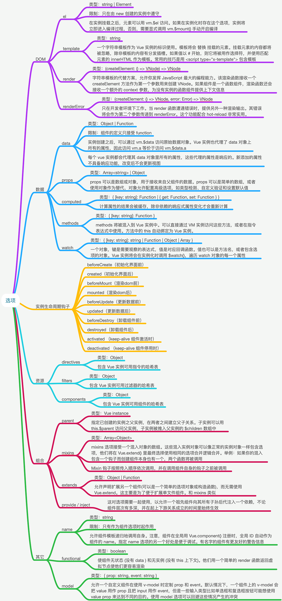

# Vue 实例选项

## Vue 是什么

> Vue 是一套用于构建用户界面的渐进式框架。与其它大型框架不同的是，Vue 被设计为可以自底向上逐层应用。Vue 的核心库只关注视图层，不仅易于上手，还便于与第三方库或既有项目整合。另一方面，当与现代化的工具链以及各种支持类库结合使用时，Vue 也完全能够为复杂的单页应用提供驱动。

使用 Vue.js 可以让 Web 开发变得简单，同时也颠覆了传统前端开发模式，它提供了现代 Web 开发中常见的高级功能，比如:

- 解耦视图与数据
- 可复用的组件
- 前端路由
- 状态管理
- 虚拟 DOM

## Vue 两个核心点

- 响应的数据绑定

当数据发生改变 → 自动更新视图

利用 [Object.definedProperty](https://developer.mozilla.org/zh-CN/docs/Web/JavaScript/Reference/Global_Objects/Object/defineProperty) 的 setter/getter 代理数据，监控对数据的操作。

`Object.definedProperty`只能兼容 IE8 以上的浏览器,vue 也是如此！

- 组合的视图组件

UI 页面映射为组件树  
划分组件可维护、可重用、可测试

## Vue 应用

一个 Vue 应用通过构造函数 Vue 就可以创建一个 Vue 的根实例，并启动 Vue；

```js
var vm = new Vue({
  // 选项
})
```

变量 vm 就代表了这个 Vue 实例,事实上几乎所有的代码都是一个对象，用来写入 Vue 实例的选项内的。

首先，必不可少的一个选项就是el，el用于指定一个页面中己存在的DOM元素来挂载 Vue 实例，它可以是 CSS 选择器，也可以是一个 HTMLElement 实例。在实例挂载之后，元素可以用 `vm.$el` 访问。

```js
<div id='app'></div>

var vm =new Vue({
    el: document.getElementByld('app')  // 或者是'#app'
});
```

如果在实例化时存在这个选项，实例将立即进入编译过程，否则，需要显式调用 `vm.$mount()` 手动开启编译。

