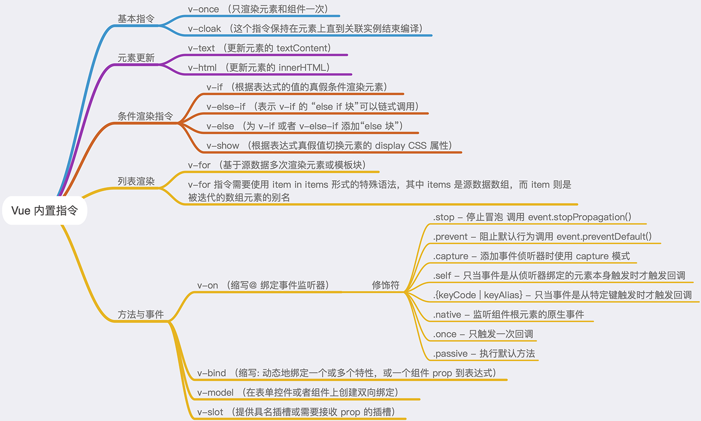

# Vue 内置指令

指令是 Vue 模板中最常用的一项功能，它带有前缀 `v-`，主要职责是当其表达式的值改变时，相应的将某些行为应用在 DOM 上。



## 基本指令

### v-clock

`v-clock` 不需要表达式，它会在 Vue 实例结束编译时从绑定的 HTML 元素上移除，经常和 css 的 `display: none`; 配合使用。用于解决初始化慢导致的页面闪动问题，对于简单的项目很实用。[wiki](https://cn.vuejs.org/v2/api/#v-cloak)

```html
<div id="app" v-cloak>
  {{ message }}
</div>

<style>
  [v-cloak] {
    display: none;
  }
</style>
```

### v-once

`v-once` 也是一个不需要表达式的指令，只渲染元素和组件一次。随后的重新渲染，元素/组件及其所有的子节点将被视为静态内容并跳过。这可以用于优化更新性能。[wiki](https://cn.vuejs.org/v2/api/#v-once)

## 条件渲染指令

### v-if、v-else-if、v-else

可以根据表达式的值在 DOM 中渲染或销毁元素/组件。 [wiki](https://cn.vuejs.org/v2/guide/conditional.html)

其会根据表达式适当地销毁或重建元素及绑定的事件或子组件。若表达式的初始值为 false ，则一开始元素或组件并不会渲染，只有条件第一次变为真时才开始编译。适合条件不经常改变的场景，因为它的切换开销相对较大。

### v-show

根据值的真假，切换元素的 display 属性。 [wiki](https://cn.vuejs.org/v2/guide/conditional.html#v-show)

`v-show` 只是简单的 css 属性切换，无论条件真与否，都会被编译。适用于频繁切换条件。

## 列表渲染

### v-for

当需要将一个数组遍历或枚举一个对象循环显示时会用到，它的表达式需结合 in 来使用，类似 `item in items` 的形式。(列表循环也支持 of 来代替 in 作为分割符，它更接近与 JavaScript) [wiki](https://cn.vuejs.org/v2/guide/list.html)

```html
<div v-for="item in items">
  {{ item.text }}
</div>
```

另外也可以为数组索引指定别名 (或者用于对象的键)：

```html
<div v-for="(item, index) in items"></div>
<div v-for="(val, key) in object"></div>
<div v-for="(val, name, index) in object"></div>
```

`v-for` 默认行为试着不改变整体，而是替换元素。迫使其重新排序的元素，你需要提供一个 key 的特殊属性：

```html
<div v-for="item in items" :key="item.id">
  {{ item.text }}
</div>
```

从 2.6 起，`v-for` 也可以在实现了可迭代协议的值上使用，包括原生的 Map 和 Set。不过应该注意的是 Vue 2.x 目前并不支持可响应的 Map 和 Set 值，所以无法自动探测变更。

### 数组更新

Vue 的核心是数据与视图的双向绑定，当我们修改数组时，Vue 会检测到数据的变化，所以用 `v-for` 渲染的视图也会立即更新。Vue 包含了一组观察数组变异的方法，使用它们改变数组也会触发视图更新：

- `push()` 方法可向数组的末尾添加一个或多个元素，并返回新的长度。

- `pop()` 方法用于删除并返回数组的最后一个元素。

- `shift()` 方法用于把数组的第一个元素从其中删除，并返回第一个元素的值。

- `unshift()` 方法可向数组的开头添加一个或更多元素，并返回新的长度。

- `splice()` 方法向/从数组中添加/删除项目，然后返回被删除的项目。

- `sort()` 方法用于对数组的元素进行排序。

- `reverse()` 方法用于颠倒数组中元素的顺序。

使用以上方法会改变被这些方法调用的原始数组，有些方法不会改变原数组，例如：

- `filter()`

- `concat()`

- `slice()`

它们返回的是一个新数组，在使用这些非变异方法时，可以使用新数组来替换原数组，例如:

```html
<div id="app">
  <ul>
    <template v-for="book in books">
      <li>书名：{{ book.name }}</li>
      <li>作者：{{ book.author }}</li>
    </template>
  </ul>
</div>

<script>
  var app = new Vue({
    el: "#app",
    data: {
      books: [
        { name: "《Vue.js 实战》", author: "梁灏" },
        { name: "《JavaScript 语言精髓》", author: "Douglas Crockford" },
        { name: "《JavaScript 高级程序设计》", author: "尼古拉斯·泽卡斯" }
      ]
    }
  });

  app.books = app.books.filter(function(item) {
    console.log(item);
    return item.name.match(/JavaScript/);
  });
</script>
```

上例渲染结果中，第一项的《Vue.js 实战》被过滤掉了，只显示书命中含有 JavaScript 的选项。

Vue 在检测到数组变化时，并不是直接重新渲染整个列表，而是最大化地复用 DOM 元素。替换的数组中含有相同元素的项不会被重新渲染，因此可以大胆地用新数组来替换旧数组，不用担心性能问题。

需要注意的是以下变动的数组中，Vue 是不能检测到的，也不会触发视图更新：

- 通过索引直接设置项，比如 `app.books[3] = { ... }`
- 修改数组长度，比如 `app.books.length = 1`

解决第一个问题可以用两种方法实现同样效果，第一种使用 Vue 内置的 set 方法:

```js
Vue.set(app.books, 3, {
  name: "《CSS揭秘》",
  author: "Lea Verou"
});
```

如果在 webpack 中使用组件化的方式，默认是没有导入 Vue 的，可以使用 `$set`,例如:

```js
this.$set(app.books, 3, {
  name: "《CSS揭秘》",
  author: "Lea Verou"
});
```

另一种方法:

```js
app.books.splice(3, 1, {
  name: "《CSS揭秘》",
  author: "Lea Verou"
});
```

第二个问题也可以直接使用 splice 来解决:

```js
app.books.splice(1);
```

对于已经创建的实例，Vue 不能动态添加根级别的响应式属性。但是，可以使用 `Vue.set(object, key, value)` 方法向嵌套对象添加响应式属性。

如需要为已有对象赋予多个新属性，应该用两个对象的属性创建一个新的对象。[wiki](https://cn.vuejs.org/v2/guide/list.html#%E5%AF%B9%E8%B1%A1%E6%9B%B4%E6%94%B9%E6%A3%80%E6%B5%8B%E6%B3%A8%E6%84%8F%E4%BA%8B%E9%A1%B9)

```js
var app = new Vue({
  data: {
    user: {
      name: "Derwin"
    }
  }
});

app.user = Object.assign({}, app.user, {
  age: 27,
  favoriteColor: "Red"
});
```

### 过滤和排序

当你不想改变原数组，想通过一个数组的副本来做过滤或排序的显示时，可以使用计算属性来返回过滤或排序后的数组。[wiki](https://cn.vuejs.org/v2/guide/list.html#%E6%98%BE%E7%A4%BA%E8%BF%87%E6%BB%A4-%E6%8E%92%E5%BA%8F%E7%BB%93%E6%9E%9C)

```html
<div id="app">
  <ul>
    <template v-for="book in filterBooks">
      <li>书名：{{ book.name }}</li>
      <li>作者：{{ book.author }}</li>
    </template>
  </ul>
</div>

<script>
  var app = new Vue({
    el: "#app",
    data: {
      books: [
        { name: "《Vue.js 实战》", author: "梁灏" },
        { name: "《JavaScript 语言精髓》", author: "Douglas Crockford" },
        { name: "《JavaScript 高级程序设计》", author: "尼古拉斯·泽卡斯" }
      ]
    },
    computed: {
      filterBooks: function() {
        return this.books.filter(function(book) {
          return book.name.match(/JavaScript/);
        });
      }
    }
  });
</script>
```

## 方法与事件

### v-on

绑定事件监听器，简写为 "@", 表达式可以直接使用 JavaScript 语句，也可以是一个在 Vue 实例中 methods 选项内的函数名。[wiki](https://cn.vuejs.org/v2/api/#v-on)

```html
<div id="app">
  点击次数： {{ counter }}
  <button @click="handleAdd()">+1</button>
  <button @click="handleAdd(10)">+1</button>
</div>

<script>
  var app = new Vue({
    el: "#app",
    data: {
      counter: 0
    },
    methods: {
      handleAdd: function(count) {
        count = count || 1;
        this.counter += count;
      }
    }
  });
</script>
```

Vue 提供了一个特殊变量 `$event`,用以访问原生的 DOM 事件，例如下面实例可以阻止链接打开:

```html
<div id="app">
  <a href="https://www.baidu.com" @click="handleClick('禁止打开', $event)"
    >打开链接</a
  >
</div>

<script>
  var app = new Vue({
    el: "#app",
    methods: {
      handleClick: function(message, event) {
        event.preventDefault();
        window.alert(message);
      }
    }
  });
</script>
```

### 事件修饰符

事件处理函数只有纯粹的逻辑判断，不处理 DOM 事件的细节，例如，阻止冒泡、取消默认行为、判断按键

修饰符的位置： `v-on:eventName.修饰符`

Vue 支持以下修饰符：

- `.stop` 阻止单击事件冒泡

- `.prevent` 提交事件不再重载页面

- `.capture` 添加事件监听器时使用事件捕获模式

- `.self` 只当事件在该元素本身触发时触发回调

- `.once` 只触发一次，组件同样适用

按键修饰符：

- `.enter`

- `.tab`

- `.delete` (捕获“删除”和“退格”键)

- `.esc`

- `.space`

- `.up`

- `.down`

- `.left`

- `.right`

- `.ctrl`

- `.alt`

- `.shift`

- `.meta` (Mac 下是 Command 键，Windows 下是窗口键)

- `.键值`

## v-bind

动态更新 HTML 元素上的属性，简写为 “:” [wiki](https://cn.vuejs.org/v2/guide/class-and-style.html#%E7%BB%91%E5%AE%9A-HTML-Class)

### 绑定 HTML Class

### 对象语法

给 `v-bind:class` 设置一个对象，可以动态切换 class ,表达式值为 true 添加 className，反之不添加。

```html
<div id="app">
  <div class="static" :class="{ 'active': isActive, 'error': isError }">
    content
  </div>
</div>
```

```js
data: {
  classObject: {
    active: true,
    'text-danger': false
  }
}
```

当 `:class` 的表达式过长或逻辑复杂时，还可以绑定一个计算属性，这是一种很友好和常见的用法，一般当条件多于两个时，都可以使用 data 或 computed ，例如使用计算属性：

```html
<div id="app">
  <div class="static" :class="classes">content</div>
</div>

<script>
  var app = new Vue({
    el: "#app",
    data: {
      isActive: true,
      error: false
    },
    computed: {
      classes: function() {
        return {
          active: this.isActive && !this.error,
          'text-danger': this.error && this.error.type === 'fatal'
        };
      }
    }
  });
</script>
```

### 数组语法

当需要应用多个 class 时，可以使用数组语法，给 :class 绑定一个数组，应用一个 class 列表

```html
div id="app">
    <div class="static" :class = "classes">content</div>
</div>

<script>
    var app = new Vue({
        el: '#app',
        data: {
            size: large,
            disabled: true
        },
        computed: {
            classes: function () {
                return [
                    'btn',
                    {
                        ['btn-' + this.size] : this.size !== '',
                        ['btn-disabled']: this.disabled
                    }
                ]
            }
        }
    })
</script>
```

使用计算属性给元素动态设置类名，在业务中经常用到，尤其是在写复用的组件时，所以在开发过程中，如果表达式较长或者逻辑复杂，应该尽可能地优先使用计算属性。

#### 在组件上使用

如果直接在自定义组件上使用 `class` 或 `:class`, 样式规则会直接应用到这个组件的根元素上。前提是自定义组件的最外层是一个根元素，否则会无效。

#### 绑定内联样式

使用 `v-bind:style` 可以给元素绑定内联样式，方法与 `:class` 类似，也有对象语法和数组语法，看起来很像直接在元素上写 `class`。(CSS 属性名使用驼峰命名或者短横分割命名)

大多数情况下，直接写一长串的样式不便于阅读和维护，所以一般写在 data 或 computed 里：

```html
<div id="app">
  <div :style="styles">content</div>
</div>

<script>
  var app = new Vue({
    el: "#app",
    data: {
      styles: {
        color: "red",
        fontSize: 14 + "px"
      }
    }
  });
</script>
```
