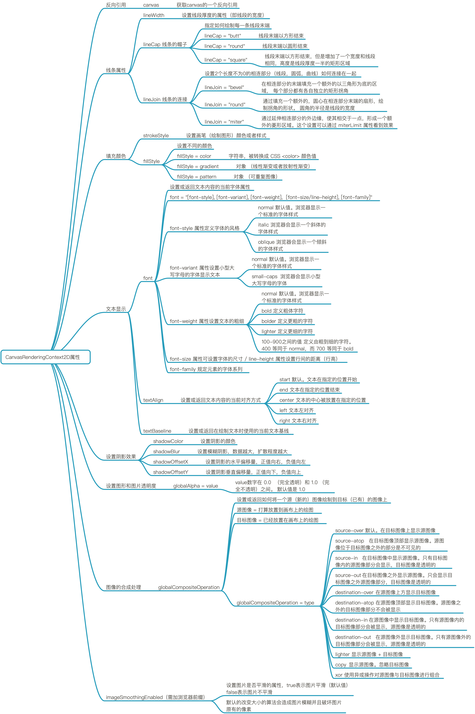
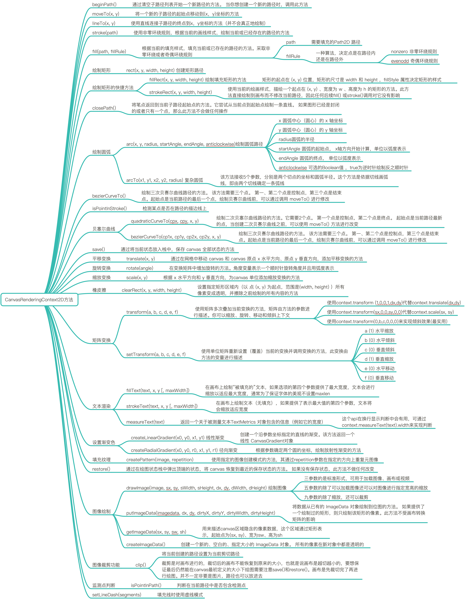
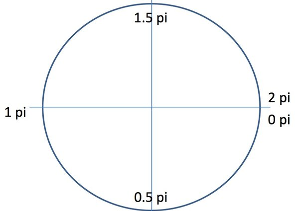

# Canvas API 详解

## 概述

> Canvas 是 HTML5 新增的元素，可用于通过使用 JavaScript 中的脚本来绘制图形。例如，它可以用于绘制图形，制作照片，创建动画，甚至可以进行实时视频处理或渲染。

## 开始使用

首先新建一个`<canvas>`网页元素

```html
<canvas id="myCanvas" width="400" height="400">
  你的浏览器不支持canvas!
</canvas>
```

上面代码中，如果浏览器不支持这个`API`，则就会显示`<canvas>`标签中间的文字——“你 de 浏览器不支持 canvas！”。

每个`canvas`节点都有一个对应的`context`对象（上下文对象），`Canvas API`定义在这个`context`对象上面，所以需要获取这个对象，方法是使用`getContext`方法。

```js
function draw() {
  var canvas = document.getElementById("myCanvas");
  if (canvas.getContext) {
    var ctx = canvas.getContext("2d");
  }
}
```

上面代码中，`getContext`方法指定参数 2d，表示该 canvas 节点用于生成 2D 图案（即平面图案）。如果参数是`webgl`，就表示用于生成 3D 图像（即立体图案），这部分实际上单独叫做`WebGL API`。

**CanvasRenderingContext2D 属性**：



**CanvasRenderingContext2D 方法**：



## 绘图方法

`canvas`画布提供了一个用来作图的平面空间，该空间的每个点都有自己的坐标，x 表示横坐标，y 表示竖坐标。原点`(0, 0)`位于图像左上角，x 轴的正向是原点向右，y 轴的正向是原点向下

> 注：因为 Canvas是基于状态的绘制（很重要，后面会解释），所以前面几步都是在确定状态，最后一步才会具体绘制。

### 1. 绘制路径

`beginPath`方法表示开始绘制路径，`moveTo(x, y)`方法设置线段的起点，`lineTo(x, y)`方法设置线段的终点，stroke 方法用来给透明的线段着色。

`moveto`和`lineto`方法可以多次使用。最后，还可以使用 closePath 方法，自动绘制一条当前点到起点的直线，形成一个封闭图形，省却使用一次 lineto 方法。

```js
// 描边三角形
ctx.beginPath(); // 开始路径绘制
ctx.moveTo(125, 125); // 设置路径起点，坐标为(125,125)
ctx.lineTo(125, 45); // 绘制一条到(125,45)的直线
ctx.lineTo(45, 125); // 绘制一条到(45,125)的直线
ctx.lineWidth = 2.0; // 设置线宽
ctx.strokeStyle = "#DA4453"; // 设置线的颜色
ctx.closePath(); // 自动绘制一条(45,125)到起点的直线
ctx.stroke(); // 进行线的着色，这时整条线才变得可见

// 填充三角形
ctx.beginPath(); // 开始路径绘制
ctx.moveTo(25, 25); // 设置路径起点，坐标为(25,25)
ctx.lineTo(105, 25); // 绘制一条到(105,25)的直线
ctx.lineTo(25, 105); // 绘制一条到(25,105)的直线
ctx.fillStyle = "#DA4453"; // 设置填充的颜色
ctx.fill(); // 填充着色，三角形可见
```

> 注：路径使用填充（filled）时，路径自动闭合，使用描边（stroked）则不会闭合路径。如果没有添加闭合路径`closePath()`到描述三角形函数中，则只绘制了两条线段，并不是一个完整的三角形。

### 2. 绘制矩形

`fillRect(x, y, width, height)`方法用来绘制矩形，它的四个参数分别为矩形左上角顶点的 x 坐标、y 坐标，以及矩形的宽和高。`fillStyle` 属性用来设置矩形的填充色。

```js
ctx.fillStyle = "#DA4453";
ctx.fillRect(50, 50, 200, 100);
// strokeRect方法与fillRect类似，用来绘制空心矩形。
ctx.strokeRect(10, 10, 200, 100);
// clearRect方法用来清除某个矩形区域的内容。
ctx.clearRect(100, 50, 50, 50);
```

### 3. 绘制圆形和扇形

`arc` 方法用来绘制扇形

```js
ctx.arc(x, y, radius, startAngle, endAngle, anticlockwise);
```

`arc` 方法的 `x` 和 `y` 参数是圆心坐标，`radius` 是半径，`startAngle` 和 `endAngle` 则是扇形的起始角度和终止角度（以弧度表示），`anticlockwise` 表示做图时应该逆时针画（true）还是顺时针画（false）。



弧度的规定是绝对的，如上图。比如你绘制 0.5pi ~ 1pi 的圆弧，如果顺时针画，就只是左下角那1/4个圆弧；如果逆时针画，就是与之互补的右上角的3/4圆弧。

下面是如何绘制实心的圆形。

```js
ctx.beginPath();
ctx.arc(60, 60, 50, 0, Math.PI * 2, true);
ctx.fillStyle = "#DA4453";
ctx.fill();
```

绘制空心圆形：

```js
ctx.beginPath();
ctx.arc(60, 60, 50, 0, Math.PI * 2, true);
ctx.lineWidth = 1.0;
ctx.strokeStyle = "#DA4453";
ctx.stroke();
```

绘制圆角矩形：

```js
function drawRoundRect(cxt, x, y, width, height, radius){
    cxt.beginPath();
    cxt.arc(x + radius, y + radius, radius, Math.PI, Math.PI * 3 / 2);
    cxt.lineTo(width - radius + x, y);
    cxt.arc(width - radius + x, radius + y, radius, Math.PI * 3 / 2, Math.PI * 2);
    cxt.lineTo(width + x, height + y - radius);
    cxt.arc(width - radius + x, height - radius + y, radius, 0, Math.PI * 1 / 2);
    cxt.lineTo(radius + x, height +y);
    cxt.arc(radius + x, height - radius + y, radius, Math.PI * 1 / 2, Math.PI);
    cxt.closePath();
}
```

### 4. 绘制文本

`fillText(string, x, y)` 用来绘制文本，它的三个参数分别为文本内容、起点的 `x` 坐标、`y` 坐标。使用之前，需用 `font` 设置字体、大小、样式（写法类似与 CSS 的 font 属性）。与此类似的还有 `strokeText` 方法，用来添加空心字。

```js
// 设置字体
ctx.font = "Bold 20px Arial";
// 设置对齐方式
ctx.textAlign = "left";
// 设置填充颜色
ctx.fillStyle = "#DA4453";
// 设置字体内容，以及在画布上的位置
ctx.fillText("Hello!", 10, 50);
// 绘制空心字
ctx.strokeText("Hello!", 10, 100);
```

> `fillText` 方法不支持文本断行，即所有文本出现在一行内。所以，如果要生成多行文本，只有调用多次 `fillText` 方法。

### 5. 设置渐变色

`createLinearGradient` 方法用来设置渐变色。

```js
// 添加渐变线
var grd = ctx.createLinearGradient(0, 0, 0, 160);
// 为渐变线添加关键色
grd.addColorStop(0, "#FFFFFF");
grd.addColorStop(0.5, "#DA4453");
grd.addColorStop(1, "#e3a31a");
```

`createLinearGradient` 方法的参数是`(x1, y1, x2, y2)`，其中 `x1` 和 `y1` 是起点坐标，`x2` 和 `y2` 是终点坐标。通过不同的坐标值，可以生成从上至下、从左到右的渐变等等。

`addColorStop` 为渐变线添加关键色(类似于颜色断点),这里的stop传递的是 0 ~ 1 的浮点数，代表断点到`(xstart,ystart)`的距离占整个渐变色长度是比例。

应用渐变：

```js
ctx.fillStyle = grd;
ctx.fillRect(10, 10, 200, 100);
```

### 6. 设置阴影

一系列与阴影相关的方法，可以用来设置阴影。

```js
ctx.shadowOffsetX = 10; // 设置水平位移
ctx.shadowOffsetY = 10; // 设置垂直位移
ctx.shadowBlur = 5; // 设置模糊度
ctx.shadowColor = "rgba(0,0,0,0.5)"; // 设置阴影颜色

ctx.fillStyle = "#CC0000";
ctx.fillRect(10, 10, 200, 100);
```

## 图像处理方法

`canvas` 更有意思的一项特性就是图像操作能力。可以用于动态的图像合成或者作为图形的背景，以及游戏界面（Sprites）等等。浏览器支持的任意格式的外部图片都可以使用，比如 PNG、GIF 或者 JPEG。 你甚至可以将同一个页面中其他 `canvas` 元素生成的图片作为图片源。

引入图像到 canvas 里需要以下两步基本操作：

1. 获得一个指向`HTMLImageElement`的对象或者另一个 canvas 元素的引用作为源，也可以通过提供一个 URL 的方式来使用图片;
2. 使用`drawImage()`函数将图片绘制到画布上

### 获得需要绘制的图片

#### 使用相同页面内的图片

可以通过下列方法的一种来获得与`canvas`相同页面内的图片的引用：

- `document.images`集合
- `document.getElementsByTagName()`方法
- 如果你知道你想使用的指定图片的 ID，你可以用`document.getElementById()`获得这个图片

```js
var imageCollection = document.images;

firstImage = imageCollection.item(0);
firstImage = imageCollection[0];
```

#### 使用其它 `canvas` 元素

和引用页面内的图片类似地，用 `document.getElementsByTagName` 或 `document.getElementById` 方法来获取其它 `canvas` 元素。但你引入的应该是已经准备好的 `canvas`。

```js
function test() {
  var canvas = document.getElementById("canvas");
  var url = canvas.toDataURL();

  var newImg = document.createElement("img");
  newImg.src = url;
  document.body.appendChild(newImg);
}
```

#### 使用`Image()`构造函数

```js
var img = new Image(); // 创建img元素
img.onload = function() {
  // 执行drawImage语句
};
img.src = "myImage.png"; // 设置图片源地址
```

#### 通过 `data: url` 方式嵌入图像

Data urls 允许用一串 Base64 编码的字符串的方式来定义一个图片。

```js
img.src =
  "data:image/gif;base64,R0lGODlhCwALAIAAAAAA3pn/ZiH5BAEAAAEALAAAAAALAAsAAAIUhA+hkcuO4lmNVindo7qyrIXiGBYAOw==";
```

其优点就是图片内容即时可用，无须再到服务器兜一圈。（还有一个优点是，可以将 CSS，JavaScript，HTML 和 图片全部封装在一起，迁移起来十分方便。）缺点就是图像没法缓存，图片大的话内嵌的 url 数据会相当的长

#### 使用视频帧

如果你有一个 ID 为`myVideo`的`<video>` 元素，你可以这样做：

```js
function getMyVideo() {
    var canvas = document.getElementById('canvas');
    if (canvas.getContext) {
    var ctx = canvas.getContext('2d');
        return document.getElementById('myVideo');
    }
}
```

它将为这个视频返回 HTMLVideoElement 对象，正如我们前面提到的，它可以作为我们的 Canvas 图片源。

### drawImage 方法

Canvas API 允许将图像文件插入画布，做法是读取图片后，使用 drawImage 方法在画布内进行重绘。

```js
var img = new Image();
img.src = "image.png"; // 允许 Base64 方式来定义图片
ctx.drawImage(img, 0, 0); // 设置对应的图像对象，以及它在画布上的位置
```

上面代码将一个 PNG 图像载入画布。`drawImage()`方法接受三个参数，第一个参数是图像文件的 DOM 元素（即``节点），第二个和第三个参数是图像左上角在画布中的坐标，上例中的`(0, 0)`就表示将图像左上角放置在画布的左上角。

由于图像的载入需要时间，`drawImage` 方法只能在图像完全载入后才能调用，因此上面的代码需要改写。

```js
var image = new Image();

image.onload = function() {
  var canvas = document.createElement("canvas");
  canvas.width = image.width;
  canvas.height = image.height;
  canvas.getContext("2d").drawImage(image, 0, 0);
  // 插入页面底部
  document.body.appendChild(image);
  return canvas;
};

image.src = "image.png"; // 允许 Base64 方式来定义图片
```

`drawImage` 方法有三种形态，上面是最基础的一种。

`drawImage` 方法的又一变种是增加了两个用于控制图像在 `canvas` 中缩放的参数。

```js
drawImage(image, x, y, width, height);
```

这个方法多了 2 个参数：width 和 height，这两个参数用来控制 当向 `canvas` 画入时应该缩放的大小

> 注意：图像可能会因为大幅度的缩放而变得起杂点或者模糊。如果您的图像里面有文字，那么最好还是不要进行缩放，因为那样处理之后很可能图像里的文字就会变得无法辨认了。

`drawImage` 方法的第三个也是最后一个变种有 8 个新参数，用于控制做切片显示的。

```js
drawImage(image, sx, sy, sWidth, sHeight, dx, dy, dWidth, dHeight);
```

第一个参数和其它的是相同的，都是一个图像或者另一个 canvas 的引用。其它 8 个参数前 4 个是定义图像源的切片位置和大小，后 4 个则是定义切片的目标显示位置和大小。


### getImageData 方法，putImageData 方法

`getImageData` 方法可以用来读取 `Canvas` 的内容，返回一个对象，包含了每个像素的信息。

```js
var imageData = ctx.getImageData(0, 0, canvas.width, canvas.height);
```

imageData 对象有一个 data 属性，它的值是一个一维数组。该数组的值，依次是每个像素的红、绿、蓝、alpha 通道值，因此该数组的长度等于图像的像素宽度 x 图像的像素高度 x 4，每个值的范围是 0–255。这个数组不仅可读，而且可写，因此通过操作这个数组的值，就可以达到操作图像的目的。修改这个数组以后，使用 `putImageData` 方法将数组内容重新绘制在 Canvas 上。

```js
ctx.putImageData(imageData, 0, 0);
```

### toDataURL 方法

对图像数据做出修改以后，可以使用 `toDataURL` 方法，将 `Canvas` 数据重新转化成一般的图像文件形式。

```js
function convertCanvasToImage(canvas) {
  var image = new Image();
  image.src = canvas.toDataURL("image/png");
  return image;
}
```

上面的代码将 Canvas 数据，转化成 PNG data URI。

### save 方法，restore 方法

save 方法用于保存上下文环境，restore 方法用于恢复到上一次保存的上下文环境。

```js
ctx.save();

ctx.shadowOffsetX = 10;
ctx.shadowOffsetY = 10;
ctx.shadowBlur = 5;
ctx.shadowColor = "rgba(0,0,0,0.5)";

ctx.fillStyle = "#CC0000";
ctx.fillRect(10, 10, 150, 100);

ctx.restore();

ctx.fillStyle = "#000000";
ctx.fillRect(180, 10, 150, 100);
```

上面代码先用 save 方法，保存了当前设置，然后绘制了一个有阴影的矩形。接着，使用 restore 方法，恢复了保存前的设置，绘制了一个没有阴影的矩形。

## 动画

利用 JavaScript，可以在 canvas 元素上很容易地产生动画效果。

```js
var canvas = document.getElementById('canvas');
var ctx = canvas.getContext('2d');
var raf;

var ball = {
    x: 100,
    y: 100,
    vx: 5,
    vy: 2,
    radius: 25,
    color: 'blue',
    draw: function() {
        ctx.beginPath();
        ctx.arc(this.x, this.y, this.radius, 0, Math.PI * 2, true);
        ctx.closePath();
        ctx.fillStyle = this.color;
        ctx.fill();
    }
};

function draw() {
    ctx.clearRect(0,0, canvas.width, canvas.height);
    ball.draw();
    ball.x += ball.vx;
    ball.y += ball.vy;
    raf = window.requestAnimationFrame(draw);
}

canvas.addEventListener('mouseover', function(e){
    raf = window.requestAnimationFrame(draw);
});

canvas.addEventListener('mouseout', function(e){
    window.cancelAnimationFrame(raf);
});

ball.draw();
```

若没有任何的碰撞检测，我们的小球很快就会超出画布。我们需要检查小球的 x 和 y 位置是否已经超出画布的尺寸以及是否需要将速度矢量反转。为了这么做，我们把下面的检查代码添加进 `draw` 函数

```js
if (ball.y + ball.vy > canvas.height || ball.y + ball.vy < 0) {
    ball.vy = -ball.vy;
}
if (ball.x + ball.vx > canvas.width || ball.x + ball.vx < 0) {
    ball.vx = -ball.vx;
}
```

## 像素处理

通过 `getImageData` 方法和 `putImageData` 方法，可以处理每个像素，进而操作图像内容。

假定 `filter` 是一个处理像素的函数，那么整个对 `Canvas` 的处理流程，可以用下面的代码表示。

```js
if (canvas.width > 0 && canvas.height > 0) {

    var imageData = context.getImageData(0, 0, canvas.width, canvas.height);

    filter(imageData);

    context.putImageData(imageData, 0, 0);

}
```

以下是几种常见的处理方法。

### 灰度效果

灰度图（grayscale）就是取红、绿、蓝三个像素值的算术平均值，这实际上将图像转成了黑白形式。假定 `d[i]`是像素数组中一个象素的红色值，则 `d[i+1]`为绿色值，`d[i+2]`为蓝色值，`d[i+3]`就是 alpha 通道值。转成灰度的算法，就是将红、绿、蓝三个值相加后除以 3，再将结果写回数组。

```js
grayscale = function (pixels) {

    var d = pixels.data;

    for (var i = 0; i < d.length; i += 4) {
        var r = d[i];
        var g = d[i + 1];
        var b = d[i + 2];
        d[i] = d[i + 1] = d[i + 2] = (r+g+b)/3;
    }

    return pixels;

};
```

### 复古效果

复古效果（sepia）则是将红、绿、蓝三个像素，分别取这三个值的某种加权平均值，使得图像有一种古旧的效果。

```js
sepia = function (pixels) {

    var d = pixels.data;

    for (var i = 0; i < d.length; i += 4) {
        var r = d[i];
        var g = d[i + 1];
        var b = d[i + 2];
        d[i]     = (r * 0.393)+(g * 0.769)+(b * 0.189); // red
        d[i + 1] = (r * 0.349)+(g * 0.686)+(b * 0.168); // green
        d[i + 2] = (r * 0.272)+(g * 0.534)+(b * 0.131); // blue
    }

    return pixels;

};
```

### 红色蒙版效果

红色蒙版指的是，让图像呈现一种偏红的效果。算法是将红色通道设为红、绿、蓝三个值的平均值，而将绿色通道和蓝色通道都设为 0。

```js
red = function (pixels) {

    var d = pixels.data;

    for (var i = 0; i < d.length; i += 4) {
        var r = d[i];
        var g = d[i + 1];
        var b = d[i + 2];
        d[i] = (r+g+b)/3;        // 红色通道取平均值
        d[i + 1] = d[i + 2] = 0; // 绿色通道和蓝色通道都设为0
    }

    return pixels;

};
```

### 亮度效果

亮度效果（brightness）是指让图像变得更亮或更暗。算法将红色通道、绿色通道、蓝色通道，同时加上一个正值或负值。

```js
brightness = function (pixels, delta) {

    var d = pixels.data;

    for (var i = 0; i < d.length; i += 4) {
          d[i] += delta;     // red
          d[i + 1] += delta; // green
          d[i + 2] += delta; // blue
    }

    return pixels;

};
```

### 反转效果

反转效果（invert）是指图片呈现一种色彩颠倒的效果。算法为红、绿、蓝通道都取各自的相反值（255-原值）。

```js
invert = function (pixels) {

    var d = pixels.data;

    for (var i = 0; i < d.length; i += 4) {
        d[i] = 255 - d[i];
        d[i+1] = 255 - d[i + 1];
        d[i+2] = 255 - d[i + 2];
    }

    return pixels;

};
```

## Reference

[Canvas API 详解](https://juejin.im/post/5ac437b5f265da238f12c1c6)

[CANVAS——Draw on the Web](https://airingursb.gitbooks.io/canvas/01.html)
