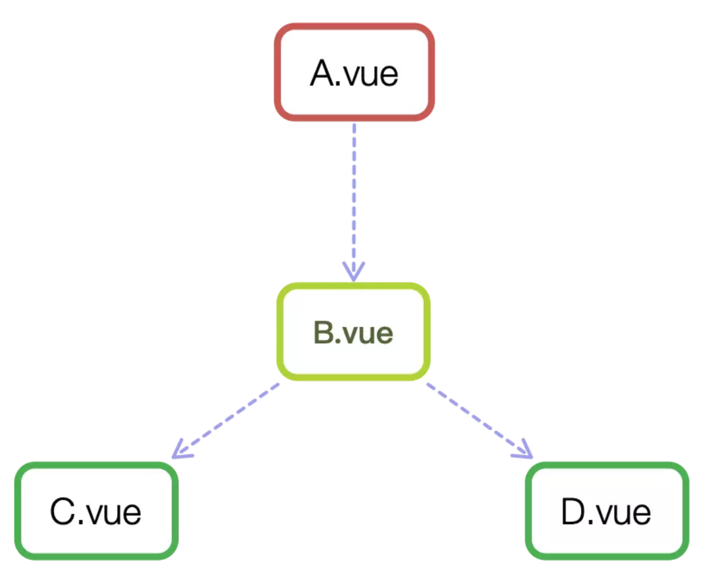

# Vue 组件进阶

## Vue 组件主要分成三类

1、由 vue-router 产生的每个页面，它本质上也是一个组件（.vue），主要承载当前页面的 HTML 结构，会包含数据获取、数据整理、数据可视化等常规业务。整个文件相对较大，但一般不会有 props 选项和 自定义事件，因为它作为路由的渲染，不会被复用，因此也不会对外提供接口。

在项目开发中，我们写的大部分代码都是这类的组件（页面），协同开发时，每人维护自己的页面，很少有交集。这类组件相对是最好写的，因为主要是还原设计稿，完成需求，不需要太多模块和架构设计上的考虑。

2、 不包含业务，独立、具体功能的基础组件，比如日期选择器、模态框等。这类组件作为项目的基础控件，会被大量使用，因此组件的 API 进行过高强度的抽象，可以通过不同配置实现不同的功能。

独立组件的开发难度要高于第一类组件，因为它的侧重点是 API 的设计、兼容性、性能、以及复杂的功能。这类组件对 JavaScript 的编程能力有一定要求，也会包含非常多的技巧，比如在不依赖 Vuex 和 Bus（因为独立组件，无法依赖其它库）的情况下，各组件间的通信，还会涉及很多脑壳疼的逻辑，比如日期选择器要考虑不同时区、国家的日历习惯，支持多种日期格式。

3、业务组件。它不像第二类独立组件只包含某个功能，而是在业务中被多个页面复用的，它与独立组件的区别是，业务组件只在当前项目中会用到，不具有通用性，而且会包含一些业务，比如数据请求；而独立组件不含业务，在任何项目中都可以使用，功能单一，比如一个具有数据校验功能的输入框。

业务组件更像是介于第一类和第二类之间，在开发上也与独立组件类似，但寄托于项目，你可以使用项目中的技术栈，比如 Vuex、axios、echarts 等，所以它的开发难度相对独立组件要容易点，但也有必要考虑组件的可维护性和复用性。

## 组件的构成

一个再复杂的组件，都是由三部分组成的：prop、event、slot，它们构成了 Vue.js 组件的 API。如果你开发的是一个通用组件，那一定要事先设计好这三部分，因为组件一旦发布，后面再修改 API 就很困难了，使用者都是希望不断新增功能，修复 bug，而不是经常变更接口。如果你阅读别人写的组件，也可以从这三个部分展开，它们可以帮助你快速了解一个组件的所有功能。

### 属性 prop

prop 定义了这个组件有哪些可配置的属性，组件的核心功能也都是它来确定的。写通用组件时，props 最好用对象的写法，这样可以针对每个属性设置类型、默认值或自定义校验属性的值，这点在组件开发中很重要，然而很多人却忽视，直接使用 props 的数组用法，这样的组件往往是不严谨的。

```html
<template>
  <button :class="'i-button-size' + size" :disabled="disabled"></button>
</template>
<script>
  // 判断参数是否是其中之一
  function oneOf(value, validList) {
    for (let i = 0; i < validList.length; i++) {
      if (value === validList[i]) {
        return true;
      }
    }
    return false;
  }

  export default {
    props: {
      size: {
        validator(value) {
          return oneOf(value, ["small", "large", "default"]);
        },
        default: "default"
      },
      disabled: {
        type: Boolean,
        default: false
      }
    }
  };
</script>
```

使用组件：

```html
<i-button size="large"></i-button> <i-button disabled></i-button>
```

要注意的是，组件里定义的 props，都是单向数据流，也就是只能通过父级修改，组件自己不能修改 props 的值，只能修改定义在 data 里的数据，非要修改，也是通过后面介绍的自定义事件通知父级，由父级来修改。

在使用组件时，也可以传入一些标准的 html 特性，比如 id、class：

```html
<i-button id="btn1" class="btn-submit"></i-button>
```

这样的 html 特性，在组件内的 `<button>` 元素上会继承，并不需要在 props 里再定义一遍。这个特性是默认支持的，如果不期望开启，在组件选项里配置 inheritAttrs: false 就可以禁用了。

### 插槽 slot

插槽 slot 可以分发组件的内容。当需要多个插槽时，会用到具名 slot，这样，父级内定义的内容，就会出现在组件对应的 slot 里，没有写名字的，就是默认的 slot。在组件的 `<slot>` 里也可以写一些默认的内容，这样在父级没有写任何 slot 时，它们就会出现。

```html
<template>
  <button :class="'i-button-size' + size" :disabled="disabled">
    <slot name="icon"></slot>
    <slot></slot>
  </button>
</template>
```

```html
<i-button>
  <i-icon slot="icon" type="checkmark">提交</i-icon>
  按钮 1
</i-button>
```

**自定义事件 event**：

```html
<template>
  <button @click="handleClick">
    <slot></slot>
  </button>
</template>
<script>
  export default {
    methods: {
      handleClick(event) {
        this.$emit("on-click", event);
      }
    }
  };
</script>
```

通过 `$emit`，就可以触发自定义的事件 `on-click` ，在父级通过 `@on-click` 来监听：

```html
<i-button @on-click="handleClick"></i-button>
```

上面的 click 事件，是在组件内部的 `<button>` 元素上声明的，这里还有另一种方法，直接在父级声明，但为了区分原生事件和自定义事件，要用到事件修饰符 `.native`，所以上面的示例也可以这样写：

```html
<i-button @click.native="handleClick"></i-button>
```

如果不写 `.native` 修饰符，那上面的 `@click` 就是自定义事件 `click`，而非原生事件 `click`，但我们在组件内只触发了 `on-click` 事件，而不是 `click`，所以直接写 `@click` 会监听不到。

## 组件的通信

一般来说，组件可以有以下几种关系：



A 和 B、B 和 C、B 和 D 都是父子关系，C 和 D 是兄弟关系，A 和 C 是隔代关系（可能隔多代）。

### Vue 内置的通信手段

组件间经常会通信，Vue.js 内置的通信手段一般有两种：

- `ref`：给元素或组件注册引用信息；
- `$parent` / `$children`：访问父 / 子实例。

这两种都是直接得到组件实例，使用后可以直接调用组件的方法或访问数据，比如下面的示例中，用 ref 来访问组件：

```js
// component-a
export default {
  data() {
    return {
      title: "Vue.js"
    };
  },
  methods: {
    sayHello() {
      window.alert("Hello");
    }
  }
};
```

```html
<template>
  <component-a ref="comA"></component-a>
</template>
<script>
  export default {
    mounted() {
      const comA = this.$refs.comA;
      console.log(comA.title); // Vue.js
      comA.sayHello(); // 弹窗
    }
  };
</script>
```

`$parent` 和 `$children` 类似，也是基于当前上下文访问父组件或全部子组件的。

这两种方法的弊端是，无法在跨级或兄弟间通信。

### 组件的通信：provide / inject

[provide / inject](https://cn.vuejs.org/v2/api/#provide-inject) 是 Vue.js 2.2.0 版本后新增的 API，我们先来看一下这个 API 怎么用，假设有两个组件： A.vue 和 B.vue，B 是 A 的子组件：

```js
// A.vue
export default {
  provide: {
    name: 'Aresn'
  }
}

// B.vue
export default {
  inject: ['name'],
  mounted () {
    console.log(this.name);  // Aresn
  }
}
```

可以看到，在 A.vue 里，我们设置了一个 provide: name，值为 Aresn，它的作用就是将 name 这个变量提供给它的所有子组件。而在 B.vue 中，通过 inject 注入了从 A 组件中提供的 name 变量，那么在组件 B 中，就可以直接通过 `this.name` 访问这个变量了，它的值也是 Aresn。这就是 provide / inject API 最核心的用法。

#### 需要注意的是

provide 和 inject 绑定并不是可响应的。这是刻意为之的。然而，如果你传入了一个可监听的对象，那么其对象的属性还是可响应的。

所以，上面 A.vue 的 name 如果改变了，B.vue 的 `this.name` 是不会改变的，仍然是 Aresn。

### 组件的通信：派发与广播

#### `$on` 与 `$emit`

`$emit` 会在当前组件实例上触发自定义事件，并传递一些参数给监听器的回调，一般来说，都是在父级调用这个组件时，使用 `@on` 的方式来监听自定义事件的，比如在子组件中触发事件：

```js
// child.vue，部分代码省略
export default {
  methods: {
    handleEmitEvent() {
      this.$emit("test", "Hello Vue.js");
    }
  }
};
```

在父组件中监听由 `child.vue` 触发的自定义事件 test：

```html
<!-- parent.vue，部分代码省略-->
<template>
  <child-component @test="handleEvent">
</template>
<script>
  export default {
    methods: {
      handleEvent (text) {
        console.log(text);  // Hello Vue.js
      }
    }
  }
</script>
```

这里看似是在父组件 `parent.vue` 中绑定的自定义事件 test 的处理句柄，然而事件 test 并不是在父组件上触发的，而是在子组件 `child.vue` 里触发的，只是通过 `v-on` 在父组件中监听。既然是子组件自己触发的，那它自己也可以监听到，这就要使用 `$on` 来监听实例上的事件，换言之，组件使用 `$emit` 在自己实例上触发事件，并用 `$on` 监听它。

#### 自行实现 dispatch 和 broadcast 方法

要实现的 dispatch 和 broadcast 方法，将具有以下功能：

- 在子组件调用 dispatch 方法，向上级指定的组件实例（最近的）上触发自定义事件，并传递数据，且该上级组件已预先通过 \$on 监听了这个事件；

- 相反，在父组件调用 broadcast 方法，向下级指定的组件实例（最近的）上触发自定义事件，并传递数据，且该下级组件已预先通过 `$on` 监听了这个事件。

复用起见，我们封装在混合（mixins）里。那它的使用样例可能是这样的：

```js
// 部分代码省略
import Emitter from "../mixins/emitter.js";

export default {
  mixins: [Emitter],
  methods: {
    handleDispatch() {
      this.dispatch(); // ①
    },
    handleBroadcast() {
      this.broadcast(); // ②
    }
  }
};
```

emitter.js 的代码：

```js
function broadcast(componentName, eventName, params) {
  this.$children.forEach(child => {
    const name = child.$options.name;

    if (name === componentName) {
      child.$emit.apply(child, [eventName].concat(params));
    } else {
      broadcast.apply(child, [componentName, eventName].concat([params]));
    }
  });
}
export default {
  methods: {
    dispatch(componentName, eventName, params) {
      let parent = this.$parent || this.$root;
      let name = parent.$options.name;

      while (parent && (!name || name !== componentName)) {
        parent = parent.$parent;

        if (parent) {
          name = parent.$options.name;
        }
      }
      if (parent) {
        parent.$emit.apply(parent, [eventName].concat(params));
      }
    },
    broadcast(componentName, eventName, params) {
      broadcast.call(this, componentName, eventName, params);
    }
  }
};
```
