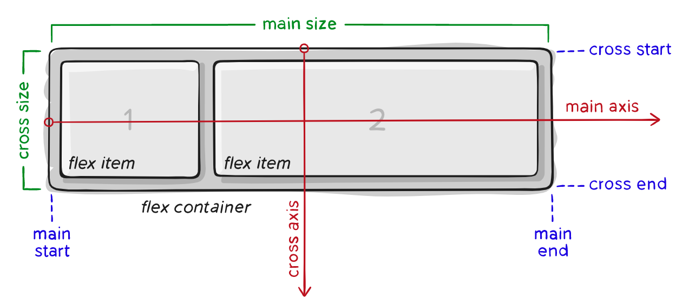

# Flex-弹性布局

Flexbox 布局（Flexible Box）模块旨在提供一个更加有效的方式制定、调整和分布一个容器里的项目布局，即使他们的大小是未知或者是动态的。（这里我们称为 Flex）。

Flex 布局主要思想是让容器有能力让其子项目能够改变其宽度、高度（甚至顺序），以最佳方式填充可用空间（主要是为了适应所有类型的显示设备和屏幕大小）。Flex 容器会使子项目（伸缩项目）扩展来填满可用空间，或缩小他们以防止溢出容器。

最重要的是，Flexbox 布局方向不可预知，他不像常规的布局（块就是从上到下，内联就从左到右）。而那些常规的适合页面布局，但对于支持大型或者杂的应用程序（特别是当他涉及到取向改变、缩放、拉伸和收缩等）就缺乏灵活性。

> 注：Flexbox 布局最适合应用程序的组件和小规模的布局，而网格布局更适合那些更大规模的布局。

## 1 基本概念

采用 Flex 布局的元素，称为伸缩容器（flex container），简称"容器"。它的所有子元素自动成为容器成员，称为伸缩项目（flex item），简称"项目"。



容器默认存在两根轴：水平的主轴（main axis）和垂直的交叉轴（cross axis）。主轴的开始位置（与边框的交叉点）叫做main start，结束位置叫做main end；交叉轴的开始位置叫做cross start，结束位置叫做cross end。

Flex项目默认沿主轴排列。单个项目占据的主轴空间叫做main size，占据的交叉轴空间叫做cross size。

Flex属性分为两部分，一部分作用于容器称容器属性，另一部分作用于项目称为项目属性。下面我们就分部的来介绍它们。

## 2 Flex容器属性


### 2.1 flex 容器定义

基本语法：

```css
.box {
  display: flex; /* 或者 inline-flex */
}
```

上述写法，定义了一个 flex 容器，根据设值的不同可以是块容器或内联容器。这使得直接子结点拥有了一个 flex 上下文。

**注意**：

CSS 的 columns 在容器上没有效果。

float、clear 和 vertical-align 在项目上没有效果。

### 2.2 flex-direction

`flex-direction`属性决定主轴的方向（即项目的排列方向）。

基本语法：

```css
.box {
  flex-direction: row | row-reverse | column | column-reverse;
}
```

- row（缺省） 表示从左向右排列
- row-reverse 表示从右向左排列
- column 表示从上向下排列
- column-reverse 表示从下向上排列

### 2.3 flex-wrap

缺省情况下，Flex 项目都排在一条线（又称"轴线"）上。我们可以通过`flex-wrap`属性的设置，让 Flex 项目换行排列。

基本语法：

```css
.box {
  flex-wrap: nowrap | wrap | wrap-reverse;
}
```

- nowrap(缺省)：所有 Flex 项目单行排列
- wrap：所有 Flex 项目多行排列，按从上到下的顺序
- wrap-reverse：所有 Flex 项目多行排列，按从下到上的顺序

### 2.4 flex-flow

`flex-flow`属性是`flex-direction`属性和`flex-wrap`属性的简写形式，默认值为`row nowrap`

基本语法：

```css
.box {
  flex-flow: <‘flex-direction’> || <‘flex-wrap’>;
}
```

### 2.5 justify-content

`justify-content`属性定义了项目在主轴上的对齐方式及额外空间的分配方式。

基本语法：

```css
.box {
  justify-content: flex-start | flex-end | center | space-between | space-around
    | space-evenly;
}
```

- flex-start(缺省)：从起点线开始顺序排列
- flex-end：相对终点线顺序排列
- center：居中排列
- space-between：项目均匀分布，第一项在起点线，最后一项在终点线
- space-around：项目均匀分布，每一个项目两侧有相同的留白空间，相邻项目之间的距离是两个项目之间留白的和
- space-evenly：项目均匀分布，所有项目之间及项目与边框之间距离相等

### 2.6 align-items

`align-items` 属性定义项目在交叉轴上的对齐方式。

基本语法：

```css
.box {
  align-items: stretch | flex-start | flex-end | center | baseline;
}
```

- stretch(缺省)：交叉轴方向拉伸显示
- flex-start：项目按交叉轴起点线对齐
- flex-end：项目按交叉轴终点线对齐
- center：交叉轴方向项目中间对齐
- baseline：交叉轴方向按第一行文字基线对齐

### 2.7 align-content

`align-content`属性定义了在交叉轴方向的对齐方式及额外空间分配，类似于主轴上`justify-content`的作用。

> 注：请注意本属性在只有一行的容器上没有效果。

基本语法：

```css
.box {
  align-content: stretch | flex-start | flex-end | center | space-between |
    space-around;
}
```

- stretch (缺省)：拉伸显示
- flex-start：从起点线开始顺序排列
- flex-end：相对终点线顺序排列
- center：居中排列
- space-between：项目均匀分布，第一项在起点线，最后一项在终点线
- space-around：项目均匀分布，每一个项目两侧有相同的留白空间，相邻项目之间的距离是两个项目之间留白的和

## 3 Flex项目属性


### 3.1 order

缺省情况下，Flex项目是按照在代码中出现的先后顺序排列的。然而order属性可以控制项目在容器中的先后顺序。

基本语法：

```css
.item {
    order: <integer>; /* 缺省 0 */
}
```

按order值从小到大顺序排列，可以为负值，缺省为0。

### 3.2 flex-grow

`flex-grow`属性定义项目的放大比例，`flex-grow`值是一个单位的正整数，表示放大的比例。默认为0，即如果存在额外空间，也不放大，负值无效。

如果所有项目的flex-grow属性都为1，则它们将等分剩余空间（如果有的话）。如果一个项目的`flex-grow`属性为2，其他项目都为1，则前者占据的剩余空间将比其他项多一倍。

基本语法：

```css
.item {
  flex-grow: <number>; /* 缺省 0 */
}
```

### 3.3 flex-shrink

`flex-shrink`属性定义了项目的缩小比例，默认为1，即如果空间不足，该项目将缩小。0表示不缩小，负值无效。

基本语法：

```css
.item {
  flex-shrink: <number>; /* 缺省 1 */
}
```

### 3.4 flex-basis

flex-basis属性定义项目在分配额外空间之前的缺省尺寸。属性值可以是长度（20%，10rem等）或者关键字auto。它的默认值为auto，即项目的本来大小。

基本语法：

```css
.item {
  flex-basis: <length> | auto; /* 缺省 auto */
}
```

### 3.5 flex

flex属性是`flex-grow`, `flex-shrink`和`flex-basis`的简写，默认值为`0 1 auto`。后两个是可选属性。

基本语法：

```css
.item {
  flex: none | [ <'flex-grow'> <'flex-shrink'>? || <'flex-basis'> ]
}
```

一般推荐使用这种简写的方式，而不是分别定义每一个属性。

### 3.6 align-self

`align-self`属性定义项目的对齐方式，可覆盖`align-items`属性。默认值为auto，表示继承父元素的`align-items`属性，如果没有父元素，则等同于`stretch`。

基本语法：

```css
.item {
  align-self: auto | flex-start | flex-end | center | baseline | stretch;
}
```

除了auto值以外，`align-self`属性与容器的`align-items`属性基本一致。

## 相关资源：

[A Complete Guide to Flexbox](https://css-tricks.com/snippets/css/a-guide-to-flexbox/)

[一个完整的Flexbox指南](https://www.w3cplus.com/css3/a-guide-to-flexbox.html)

[【基础知识】Flex-弹性布局原来如此简单！！](https://juejin.im/post/5ac2329b6fb9a028bf057caf#heading-18)

[一劳永逸的搞定 flex 布局](https://juejin.im/post/58e3a5a0a0bb9f0069fc16bb#heading-3)

[Flex 布局教程：实例篇](http://www.ruanyifeng.com/blog/2015/07/flex-examples.html)

[TOOL 移动端快速布局的神器 flex.css](https://github.com/lzxb/flex.css)
