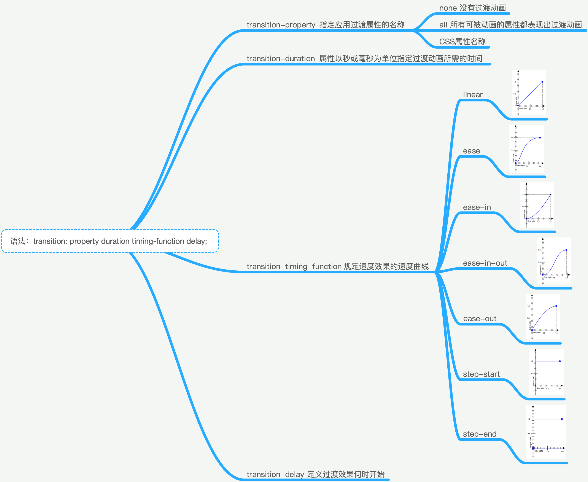
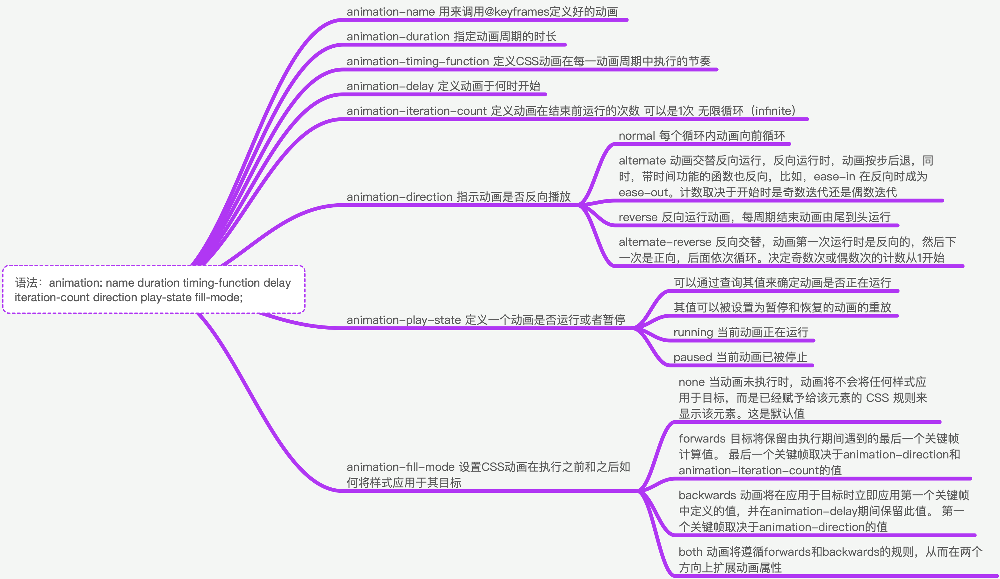

# CSS3 动画实践

需求中常见的 css3 动画一般有补间动画（又叫“关键帧动画”）和逐帧动画两种，下面分别介绍：

## 补间动画/关键帧动画

常用于实现位移、颜色（透明度）、大小、旋转、倾斜等变化。一般有 Transitions 和 Keyframes animation 两种方法实现补间动画。

Transitions：用于实现简单的动画，只有起始两帧过渡。多用于页面的交互操作，使交互效果更生动活泼。

> CSS 的 transition 允许 CSS 的属性值在一定的时间区间内平滑地过渡。这种效果可以在鼠标单击、获得焦点、被点击或对元素任何改变中触发，并圆滑地以动画效果改变 CSS 的属性值。

Keyframes animation：用于实现较为复杂的动画，一般关键帧较多。

> 设置动画的关键帧规则 animation 的 timing-function 设置为 ease、linear 或 cubic-bezier，它会在每个关键帧之间插入补间动画，产生具有连贯性的动画。

## 逐帧动画

animation 的 timing-function 默认值为 ease，它会在每个关键帧之间插入补间动画，所以动画效果是连贯性的。除了 ease、linear、cubic-bezier 之类的过渡函数都会为其插入补间。有些效果不需要补间，只需要关键帧之间的跳跃，这时应该使用 steps 过渡方式。

逐帧动画可用于loading动画，但更多的用于Sprite精灵动画（人物运动）。精灵动画把所有帧都放在一起，通过CSS3的animation控制background-position。

[CSS3动画实践](https://aotu.io/notes/2016/01/04/css3-animation/index.html)