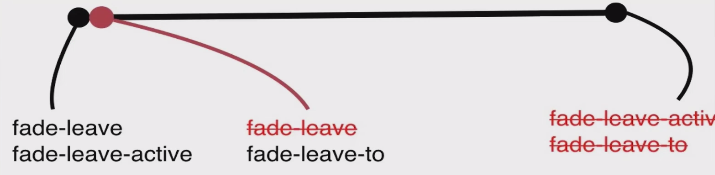

# Vue 动画效果

## Vue 中的 CSS 动画原理

> 当一个元素被transition 包裹之后，Vue 会自动分析元素的 CSS 样式，然后构建一个动画流程。

在进入/离开的过渡中，会有 6 个 class 切换。

1. v-enter：定义进入过渡的开始状态。在元素被插入之前生效，在元素被插入之后的下一帧移除。

2. v-enter-active：定义进入过渡生效时的状态。在整个进入过渡的阶段中应用，在元素被插入之前生效，在过渡/动画完成之后移除。这个类可以被用来定义进入过渡的过程时间，延迟和曲线函数。

3. v-enter-to: 2.1.8版及以上 定义进入过渡的结束状态。在元素被插入之后下一帧生效 (与此同时 v-enter 被移除)，在过渡/动画完成之后移除。

4. v-leave: 定义离开过渡的开始状态。在离开过渡被触发时立刻生效，下一帧被移除。

5. v-leave-active：定义离开过渡生效时的状态。在整个离开过渡的阶段中应用，在离开过渡被触发时立刻生效，在过渡/动画完成之后移除。这个类可以被用来定义离开过渡的过程时间，延迟和曲线函数。

6. v-leave-to: 2.1.8版及以上 定义离开过渡的结束状态。在离开过渡被触发之后下一帧生效 (与此同时 v-leave 被删除)，在过渡/动画完成之后移除。


`Vue` 会在动画即将执行的瞬间，往内部被包裹的的 `div` 上增添两个 `class` 名，分别是 `fade-enter` 和 `fade-enter-active` 。当动画第一帧执行结束之后；`Vue` 会在动画执行到第二帧的时候，把之前添加的 `fade-enter` 这个 `class` 去除，然后再增加一个 `fade-enter-to` 的 `class` 名；接着动画继续执行，执行到结束的瞬间，Vue 会把之前添加的 fade-enter-active 和 fade-enter-to 两个 class 都去除掉。



当动画从显示状态变为隐藏状态时，流程跟上相似。

> CSS 动画用法同 CSS 过渡，区别是在动画中 `v-enter` 类名在节点插入 DOM 后不会立即删除，而是在 `animationend` 事件触发时删除。

## 自定义过渡的类名

如果 CSS 样式没有进行这种方式命名，而是我们通过自定义的方式命名的，如下：

```css
.active {
    transform-origin: left center;
    animation: bounce-in 1s;
}

.leave {
    transform-origin: left center;
    animation: bounce-in 1s reverse;
}
```

那么在 `transition` 标签里面就要对这个自定义的 `class` 进行声明。

```html
<transition
    name="fade"
    enter-active-class="active"
    leave-active-class="leave"
>
    <div v-if="show">
        hello world
    </div>
</transition>
```

自定义类名的优先级高于普通的类名，这对于 Vue 的过渡系统和其他第三方 CSS 动画库，如 Animate.css 结合使用十分有用。

```html
<transition
    name="fade"
    enter-active-class="animated tada"
    leave-active-class="animated bounceOutRight"
>
    <div v-if="show">
        hello world
    </div>
</transition>
```

## 初始渲染的过渡

可以通过 `appear` 特性设置节点在初始渲染的过渡

```html
<transition appear>
    <!-- ... -->
</transition>
```

这里默认和进入/离开过渡一样，同样也可以自定义 CSS 类名。

```html
<transition
    appear
    appear-class="custom-appear-class"
    appear-to-class="custom-appear-to-class" (2.1.8+)
    appear-active-class="custom-appear-active-class"
>
    <!-- ... -->
</transition>
```

## 同时使用过渡和动画

Vue 为了知道过渡的完成，必须设置相应的事件监听器。它可以是 `transitionend` 或 `animationend` ，这取决于给元素应用的 CSS 规则。如果你使用其中任何一种，Vue 能自动识别类型并设置监听。

但是，在一些场景中，你需要给同一个元素同时设置两种过渡动效，比如 `animation` 很快的被触发并完成了，而 `transition` 效果还没结束。在这种情况中，你就需要使用 `type` 特性并设置 `animation` 或 `transition` 来明确声明你需要 Vue 监听的类型。

## 显性的过渡持续时间

在很多情况下，Vue 可以自动得出过渡效果的完成时机。默认情况下，Vue 会等待其在过渡效果的根元素的第一个 `transitionend` 或 `animationend` 事件。然而也可以不这样设定——比如，我们可以拥有一个精心编排的一系列过渡效果，其中一些嵌套的内部元素相比于过渡效果的根元素有延迟的或更长的过渡效果。

在这种情况下你可以用 `<transition>` 组件上的 `duration` 属性定制一个显性的过渡持续时间 (以毫秒计)

## JavaScript 钩子

可以在属性中声明 JavaScript 钩子

```html
<transition
    v-on:before-enter="beforeEnter"
    v-on:enter="enter"
    v-on:after-enter="afterEnter"
    v-on:enter-cancelled="enterCancelled"

    v-on:before-leave="beforeLeave"
    v-on:leave="leave"
    v-on:after-leave="afterLeave"
    v-on:leave-cancelled="leaveCancelled"
>
    <!-- ... -->
</transition>
```

```js
// ...
methods: {
    // --------
    // 进入中
    // --------

    beforeEnter: function (el) {
        // ...
    },
    // 当与 CSS 结合使用时
    // 回调函数 done 是可选的
    enter: function (el, done) {
        // ...
        done()
    },
    afterEnter: function (el) {
        // ...
    },
    enterCancelled: function (el) {
        // ...
    },

    // --------
    // 离开时
    // --------

    beforeLeave: function (el) {
        // ...
    },
    // 当与 CSS 结合使用时
    // 回调函数 done 是可选的
    leave: function (el, done) {
        // ...
        done()
    },
    afterLeave: function (el) {
        // ...
    },
    // leaveCancelled 只用于 v-show 中
    leaveCancelled: function (el) {
        // ...
    }
}
```

这些钩子函数可以结合 CSS `transitions/animations` 使用，也可以单独使用。

> 当只用 `JavaScript` 过渡的时候，在 `enter` 和 `leave` 中必须使用 `done` 进行回调。否则，它们将被同步调用，过渡会立即完成。推荐对于仅使用 `JavaScript` 过渡的元素添加 `v-bind:css="false"`，`Vue` 会跳过 `CSS` 的检测。这也可以避免过渡过程中 `CSS` 的影响。

## 多个元素的过渡

最常见的多标签过渡是一个列表和描述这个列表为空消息的元素：

```html
<transition>
    <table v-if="items.length > 0">
        <!-- ... -->
    </table>
    <p v-else>Sorry, no items found.</p>
</transition>
```

注：当有相同标签名的元素切换时，需要通过 `key` 特性设置唯一的值来标记以让 `Vue` 区分它们，否则 `Vue` 为了效率只会替换相同标签内部的内容。即使在技术上没有必要，给在 `<transition>` 组件中的多个元素设置 `key` 是一个更好的实践。

```html
<transition>
    <button v-if="isEditing" key="save">
        Save
    </button>
    <button v-else key="edit">
        Edit
    </button>
</transition>
```

在一些场景中，也可以通过给同一个元素的 key 特性设置不同的状态来代替 v-if 和 v-else，上面的例子可以重写为：

```html
<transition>
    <button v-bind:key="isEditing">
        {{ isEditing ? 'Save' : 'Edit' }}
    </button>
</transition>
```

## 多个组件的过渡

多个组件的过渡简单很多 - 我们不需要使用 key 特性。相反，我们只需要使用动态组件：

```html
<transition name="component-fade" mode="out-in">
    <component v-bind:is="view"></component>
</transition>
```

```js
new Vue({
    el: '#transition-components-demo',
    data: {
        view: 'v-a'
    },
    components: {
        'v-a': {
            template: '<div>Component A</div>'
        },
        'v-b': {
            template: '<div>Component B</div>'
        }
    }
})
```

```css
.component-fade-enter-active, .component-fade-leave-active {
    transition: opacity .3s ease;
}
.component-fade-enter, .component-fade-leave-to {
    opacity: 0;
}
```
