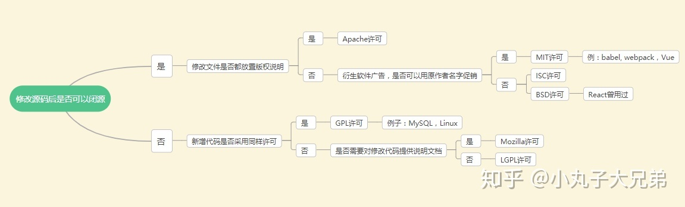

# 如何用 npm 发布包

首先，替换 `npm` 源为官方源，如果之前没有更换为淘宝源的不需要进行这步。

```js
npm config set registry https://registry.npmjs.org/
```

然后，需要到[npm 官方网站](https://www.npmjs.com/)注册个账号。之后回到我们的工程目录，执行

```js
npm login
```

输入我们注册的 npm 账号、密码和邮箱。到这里，我们已经相当于在命令行中登录到 npm 官网中。

下面我们需要进行几步操作。

## 完善基本信息

打开命令行，新建一个目录 `mkdir npm-publish-test`,执行 `npm init -y` 初始化一个默认的包文件 `package.json`

```js
{
  "name": "npm-publish-test",
  "version": "1.0.0",
  "description": "",
  "main": "index.js",
  "scripts": {
    "test": "echo \"Error: no test specified\" && exit 1"
  },
  "keywords": [],
  "author": "",
  "license": "ISC"
}
```

`package.json` 中最重要的属性是 `name` 和 `version` 两个属性，这两个属性是必须要有的，否则模块就无法被安装，这两个属性一起形成了一个 `npm` 模块的唯一标识符。模块中内容变更的同时，模块版本也应该一起变化。

**name** 发布到 `npm` 上的包名，也即别人安装时输入的名字 `yarn add ${name}`, 需要保证唯一，npm 仓库上的包名是不能重复的，包名应该取个简短而语义化的值, 不能含有大写字母，可以用中划线分割。

**version** 是语义化的，`major.minor.patch` 如果是 major 变动，通常意味着不兼容的修改; 如果是 minor，意味着添加向后兼容的新功能，如果是 patch, 意味着 bug 的修复。详情见 [semver.org](https://semver.org/lang/zh-CN/)

**description** 是对包的描述，在 [npmjs.com](https://www.npmjs.com/) 上搜索时会显示，有助于用户在搜索时进行筛选

**keywords** 同样也是帮助用户查找到你的包

**author** 的格式一般是 `${your name} ${email}`, 当然也可以是一个 `github` 地址

**license** 可能很多人会忽略，最好也写上去。

`license` 是开源许可说明。在开源世界里，`license` 是具有法律效力的，通过选择相应的 `license`，版权拥有者可以声称自己相应的权利，包括其他人使用、修改、引用、共享等一系列涉及版权的操作。



**repository** 的格式参考如下：

```js
"repository": {
    "type": "git",
    "url": "https://github.com/daixwu/print-canvas.git"
}
```

这样在 `npm` 包页面就有会个 `github` 的入口。

**main** 定义了包的入口文件，在 `NodeJs` 环境，语句 `import pkg from 'package-name'` 时，其实导入的就是 `main` 定义的文件，它可以是 `CommonJs` 格式的, 也可以是 `umd` 格式

**module** 表示如果支持 `module` 字段则会优先使用 ES6 模块规范的版本，这样可以启用 `Tree Shaking` 机制。参见[聊聊 package.json 文件中的 module 字段](https://juejin.im/entry/5a99ed5c6fb9a028cd448d6a)

在 `package.json` 文件中看起来会是这个样子：

```js
{
  "main": "dist/dist.js",
  "module": "dist/dist.es.js"
}
```

相当于在一个包内同时发布了两种模块规范的版本。

当打包工具遇到我们的模块时：

- 如果它已经支持 `module` 字段则会优先使用 ES6 模块规范的版本，这样可以启用 `Tree Shaking` 机制。
- 如果它还不识别 `module` 字段则会使用我们已经编译成 `CommonJS` 规范的版本，也不会阻碍打包流程。

要构建一个满足 `module` 字段要求的包其实很简单。如果你是使用 `Rollup` 打包代码， 那么只需要把 `output` 的格式设置为 `es` 就可以啦。

```js
// rollup.config.js
export default {
  ...,
  output: {
    file: 'bundle.es.js',
    format: 'es'
  }
};
```

**scripts** 为了防止出现发包前忘记构建的乌龙事件，定义一下发布前的脚本, 这样每次执行`npm publish`前都会先执行 `npm run build`

```js
"prepublishOnly": "npm run build"
```

**engines** 可以告诉用户运行你的包对 `NodeJs` 版本的要求，这是非常重要的，不然你使用了 `NodeJs` 新版本特性，却没有定义该字段，导致低版本 `NodeJs` 用户运行报错，让人摸不着头脑。

```js
"engines": {
   "node": ">= 4.0.0",
   "npm": ">= 3.0.0"
}
```

## 定义依赖

**dependencies** 是运行你的包必须安装的依赖，用户在使用 `npm install` 安装你的包时会自动安装这些依赖。`-save`参数表示将该模块写入 `dependencies` 属性，

**devDependencies** 是开发你的包时需要安装的依赖，通常是一些开发、测试、打包工具，例如 `webpack`、`ESLint`、`Mocha`。应用正常运行并不依赖于这些包，用户在使用 `npm install` 安装你的包时也不会安装这些依赖。`--save-dev` 表示将该模块写入 `devDependencies` 属性。

**peerDependencies** 一般用于开发插件的场景，应用运行依赖的宿主包。最典型的就是插件，例如各种 `jQuery` 插件，这些插件本身不包含 `jQeury`，需要外部提供。用户使用 npm 1 或 2 时会自动安装这种依赖，npm 3 不会自动安装，会提示用户安装。扩展：[探讨 npm 依赖管理之 peerDependencies](https://www.cnblogs.com/wonyun/p/9692476.html)

## 忽略文件

如果有`.gitignore` 文件，则发布时会忽略`.gitignore` 中定义的文件; 也即这些文件不需要在`.npmignore` 重新定义。如果用`.gitignore` 忽略了 `dist` 目录，但发包时又需要发布 `dist` 目录，此时可以在 `package.json` 定义 `files` 字段，这是一个白名单，里面的文件都会被发布出去

```js
"files": [
  "dist"
]
```

需要注意的是，子文件夹`.gitignore` 或`.npmignore` 同样有效，而它们会覆盖 `files` 字段
另外，有些文件无论如何设置，都不会发布出去：

```js
node_modules.git(包括.gitignore);
```

## `README.md`

别忘了这个文件，写下与包相关的更具体的信息，告诉用户这个包有哪些功能，如何使用。这很重要，用户不会使用一个没有文档说明的包！

## 包发布

如何发布这个已经开发好的包。
在项目根目录下执行

`npm whoami` 验证你的凭据已存储在客户端，注册成功了就会显示你的用户名

`npm publish` 发布包

### 更新一个已经发布的包

当你更改了代码，准备重新发布包的时候

先执行 `npm version major/minor/patch` 更新对应版本，

然后再执行

`npm publish` 进行发布

### 删除包

`npm unpublish 包名@版本号` 删除指定的版本

`npm unpublish 包名 --force` 删除整个包

## 打标签

假设你的包最新版本是 `1.0.0`, 当用户 `yarn add my-awesome-package` 或 `yarn add my-awesome-package@1.0.0`时，其实是相当于 `yarn add my-awesome-package@latest`, 即不指定标签安装时，默认安装 `latest` 版本。

假设你正在开发 `2.0.0` 版本，它还不稳定，你想发布它让用户测试一波，此时又不能让它变成 `latest` 版本，不然用户 `yarn add my-awesome-package` 时就安装了 `2.0.0` 了，那将让用户崩溃。这时该怎么办呢？标签就用上场了。

可以这样发布 `npm publish --tag beta` 则用户 `yarn add my-awesome-package` 安装的是 1.0.0 版本， `yarn add my-awesome-package@beta` 时，安装的是 `2.0.0` 版本，不影响老用户，棒！

记住，你只能对一个版本打一个标签，使用 `npm dist-tag ls` 可以查看 `npm` 包一共打了几个标签。

## 参考阅读

[版本命名及限定规则详解](https://segmentfault.com/a/1190000011368506)

[vue 组件发布 npm 最佳实践](https://juejin.im/post/5b231f6ff265da595f0d2540)

[rollup.js 打包 vue 组件并发布到 npm 网站](https://www.jianshu.com/p/530451cf95c9)

[手把手教你如何用 npm 发布包](https://zhuanlan.zhihu.com/p/74153919)

[package.json 非官方字段集合](https://segmentfault.com/a/1190000016365409)

[揭秘vue-sfc-cli: 组件研发利器](https://zhuanlan.zhihu.com/p/72590127)
