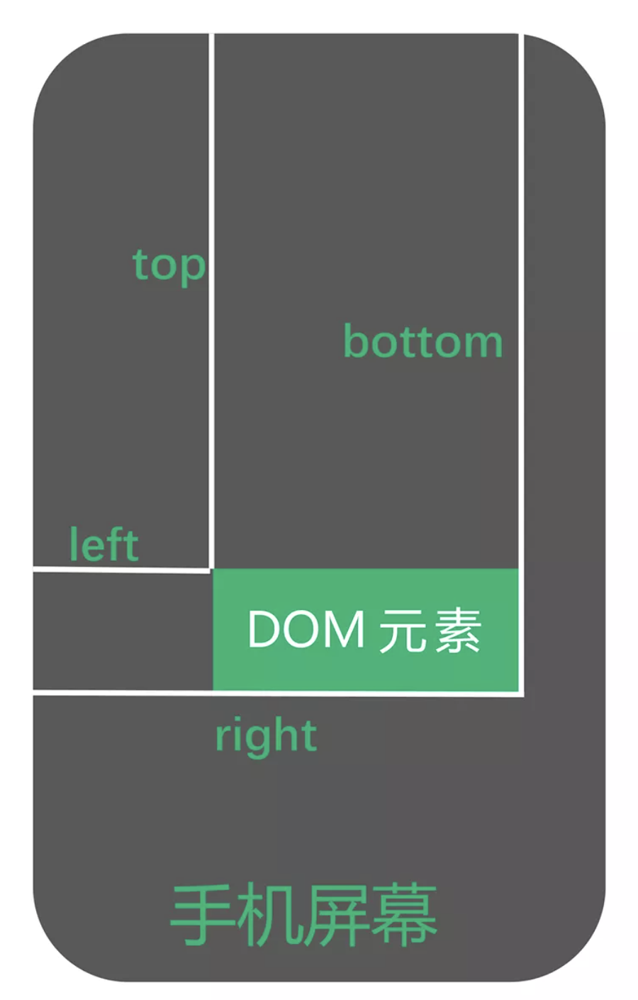

# JS API

## BOM

- [navigator](https://developer.mozilla.org/zh-CN/docs/Web/API/Navigator) 浏览器信息

- [screen](https://developer.mozilla.org/zh-CN/docs/Web/API/Screen) 屏幕信息

> [理清window和document的区别以及两者的宽高](https://www.jianshu.com/p/b28a4dcd1b8c)

- [location](https://developer.mozilla.org/zh-CN/docs/Web/API/Location) 地址信息

- [history](https://developer.mozilla.org/zh-CN/docs/Web/API/History) 前进后退信息

## DOM

如何获取文档中任意一个元素距离文档 document 顶部的距离？

### 原始方法

```js
const offset = ele => {
  let result = {
    top: 0,
    left: 0
  }

  const getOffset = (node, init) => {
    // 1 代表元素 Element 2 代表属性 Attr 3 代表元素或属性中的文本内容 Text
    if (node.nodeType !== 1) {
      return
    }

    position = window.getComputedStyle(node)['position']

    if (typeof(init) === 'undefined' && position === 'static') {
      getOffset(node.parentNode)
      return
    }

    result.top = node.offsetTop + result.top - node.scrollTop
    result.left = node.offsetLeft + result.left - node.scrollLeft

    if (position === 'fixed') {
        return
    }

    getOffset(node.parentNode)
  }

  // 当前 DOM 节点的 display === 'none' 时, 直接返回 {top: 0, left: 0}
  if (window.getComputedStyle(ele)['display'] === 'none') {
      return result
  }

  let position

  getOffset(ele, true)

  return result
}
```

### getBoundingClientRect 方法

[getBoundingClientRect](https://developer.mozilla.org/zh-CN/docs/Web/API/Element/getBoundingClientRect) 方法用来描述一个元素的具体位置，该位置的下面四个属性都是相对于视口左上角的位置而言的。对某一节点执行该方法，它的返回值是一个 DOMRect 类型的对象。这个对象表示一个矩形盒子，它含有：left、top、right 和 bottom 等只读属性。



```js
const offset = ele => {
  let result = {
      top: 0,
      left: 0
  }
  // 当前为 IE11 以下，直接返回 {top: 0, left: 0}
  if (!ele.getClientRects().length) {
      return result
  }

  // 当前 DOM 节点的 display === 'none' 时，直接返回 {top: 0, left: 0}
  if (window.getComputedStyle(ele)['display'] === 'none') {
      return result
  }

  result = ele.getBoundingClientRect()
  var docElement = ele.ownerDocument.documentElement

  return {
      top: result.top + window.pageYOffset - docElement.clientTop,
      left: result.left + window.pageXOffset - docElement.clientLeft
  }
}
```

ownerDocument 是 DOM 节点的一个属性，它返回当前节点的顶层的 document 对象。ownerDocument 是文档，documentElement 是根节点。

`docElement.clientTop`，clientTop 是一个元素顶部边框的宽度，不包括顶部外边距或内边距。

## 数组 reduce 方法的相关实现

数组方法非常重要：因为数组就是数据，数据就是状态，状态反应着视图。对数组的操作我们不能陌生，其中 [reduce](https://developer.mozilla.org/zh-CN/docs/Web/JavaScript/Reference/Global_Objects/Array/Reduce) 方法更要做到驾轻就熟。我认为这个方法很好地体现了「函数式」理念，也是当前非常热门的考察点之一。

它的使用语法：

```js
arr.reduce(callback(previousValue, currentValue[, currentIndex[, array]])[, initialValue])
```

这里我们简要介绍一下。

- reduce 第一个参数 callback 是核心，它对数组的每一项进行「叠加加工」，其最后一次返回值将作为 reduce方法的最终返回值。 它包含 4 个参数：
  
  - previousValue　表示「上一次」 callback 函数的返回值

  - currentValue　数组遍历中正在处理的元素

  - currentIndex　可选，表示 currentValue 在数组中对应的索引。如果提供了 initialValue，则起始索引号为 0，否则为 1

  - array　可选，调用 `reduce()` 的数组

- initialValue 可选，作为第一次调用 callback 时的第一个参数。如果没有提供 initialValue，那么数组中的第一个元素将作为  callback 的第一个参数。

### reduce 实现 runPromiseInSequence

```js
const runPromiseInSequence = (array, value) => array.reduce(
   (promiseChain, currentFunction) => promiseChain.then(currentFunction),
   Promise.resolve(value)
)
```

runPromiseInSequence 方法将会被一个每一项都返回一个 Promise 的数组调用，并且依次执行数组中的每一个 Promise，可以参考示例：

```js
const f1 = () => new Promise((resolve, reject) => {
  setTimeout(() => {
      console.log('p1 running')
      resolve(1)
  }, 1000)
})

const f2 = () => new Promise((resolve, reject) => {
  setTimeout(() => {
      console.log('p2 running')
      resolve(2)
  }, 1000)
})

const array = [f1, f2]

const runPromiseInSequence = (array, value) => array.reduce(
  (promiseChain, currentFunction) => promiseChain.then(currentFunction),
  Promise.resolve(value)
)

runPromiseInSequence(array, 'init')
```

### reduce 实现 pipe

reduce 的另外一个典型应用可以参考函数式方法 pipe 的实现：`pipe(f, g, h)` 是一个 curry 化函数，它返回一个新的函数，这个新的函数将会完成 `(...args) => h(g(f(...args)))` 的调用。即 pipe 方法返回的函数会接收一个参数，这个参数传递给 pipe 方法第一个参数，以供其调用。

```js
const pipe = (...functions) => input => functions.reduce(
  (acc, fn) => fn(acc),
  input
)
```

仔细体会 runPromiseInSequence 和 pipe 这两个方法，它们都是 reduce 应用的典型场景。

### 实现一个 reduce

```js
Array.prototype.reduce = Array.prototype.reduce || function(func, initialValue) {
  let arr = this
  let base = typeof initialValue === 'undefined' ? arr[0] : initialValue
  let startPoint = typeof initialValue === 'undefined' ? 1 : 0
  arr.slice(startPoint)
    .forEach(function(val, index) {
      base = func(base, val, index + startPoint, arr)
    })
  return base
}
```

### 通过 Koa only 模块源码认识 reduce

通过了解并实现 reduce 方法，我们对它已经有了比较深入的认识。最后，再来看一个 reduce 使用示例——通过 Koa 源码的 only 模块，加深印象：

```js
var o = {
  a: 'a',
  b: 'b',
  c: 'c'
}
only(o, ['a','b'])   // {a: 'a',  b: 'b'}
```

该方法返回一个经过指定筛选属性的新对象。 ​

only 模块实现：

```js
var only = function(obj, keys){
  obj = obj || {}
  if ('string' == typeof keys) keys = keys.split(/ +/)
  return keys.reduce(function(ret, key) {
    if (null == obj[key]) return ret
    ret[key] = obj[key]
    return ret
  }, {})
}
```

### compose 实现的几种方案

compose 其实和前面提到的 pipe 一样，就是执行一连串不定长度的任务（方法），比如：

```js
let funcs = [fn1, fn2, fn3, fn4]
let composeFunc = compose(...funcs)
```

执行：

```js
composeFunc(args)
```

就相当于：

```js
fn1(fn2(fn3(fn4(args))))
```

总结一下 compose 方法的关键点：

- compose 的参数是函数数组，返回的也是一个函数

- compose 的参数是任意长度的，所有的参数都是函数，执行方向是自右向左的，因此初始函数一定放到参数的最右面

- compose 执行后返回的函数可以接收参数，这个参数将作为初始函数的参数，所以初始函数的参数是多元的，初始函数的返回结果将作为下一个函数的参数，以此类推。因此除了初始函数之外，其他函数的接收值是一元的

我们发现，实际上，compose 和 pipe 的差别只在于调用顺序的不同：

```js
// compose
fn1(fn2(fn3(fn4(args))))

// pipe
fn4(fn3(fn2(fn1(args))))
```

compose 最简单的实现是面向过程的：

```js
const compose = function(...args) {
  let length = args.length
  let count = length - 1
  let result
  return function f1(...arg1) {
    result = args[count].apply(this, arg1)
    if (count <= 0) {
      count = length - 1
      return result
    }
    count--
    return f1.call(null, result)
  }
}
```

这里的关键是用到了闭包，使用闭包变量储存结果 result 和函数数组长度以及遍历索引，并利用递归思想，进行结果的累加计算。整体实现符合正常的面向过程思维，不难理解。

利用 reduce 方法实现：

```js
const reduceFunc = (f, g) => (...arg) => g.call(this, f.apply(this, arg))
const compose = (...args) => args.reverse().reduce(reduceFunc, args.shift())
```

利用 Promise 实现：

```js
const compose = (...args) => {
   let init = args.pop()
   return (...arg) =>
   args.reverse().reduce((sequence, func) =>
     sequence.then(result => func.call(null, result))
   , Promise.resolve(init.apply(null, arg)))
}
```

这种实现利用了 Promise 特性：首先通过 `Promise.resolve(init.apply(null, arg))` 启动逻辑，启动一个 resolve 值为最后一个函数接收参数后的返回值，依次执行函数。因为 `promise.then()` 仍然返回一个 Promise 类型值，所以 reduce 完全可以按照 Promise 实例执行下去。


