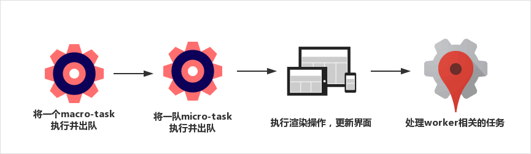
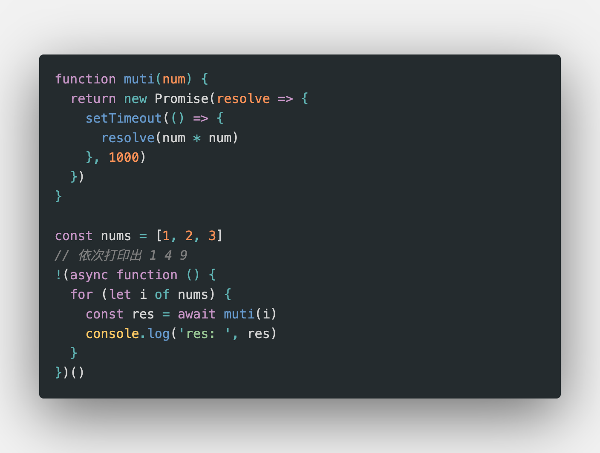

# 异步

## 同步异步区别

同步阻塞代码执行，异步不会阻塞代码执行，用以解决单线程等待的问题，基于回调 callback 函数形式执行。

## 单线程和异步

- JS 是单线程语言，只能同时做一件事儿

- 浏览器和 nodejs 已支持 JS 启动进程，如 Web Worker

- JS 和 DOM 渲染共同用同一个线程，因为 JS 可修改 DOM 结构

## 异步应用场景

- 网络请求，如 ajax 图片加载

- 定时任务， 如 setTimeout

## event loop(事件循环/事件轮询) 异步回调的实现原理

1. 同步代码一行一行放在 Call Stack 执行

2. 遇到异步会先“记录”下，等待事件（定时、网络请求等）

3. 时机到了就移动到 Callback Queue

4. 如果 Call Stack 为空（即同步代码执行完）Event Loop 开始工作

5. 轮询查找 Callback Queue 如有则移动到 Call Stack 执行

6. 然后继续轮询查找（永动机一样）

## DOM 事件和 event loop

- 异步（setTimeout， ajax等）使用回调，基于 event loop

- DOM 事件也使用回调，基于 event loop

## 宏任务（macroTask）和微任务（microTask）

- 宏任务：DOM 渲染后触发 如 setTimeout、setInterval、Ajax、DOM 事件

- 微任务：DOM 渲染前触发 如 Promise、async / await

- 微任务执行时机比宏任务要早

event loop 和 DOM 渲染



```js
async function async1 () {
  console.log('async1 start') // 2
  await async2() // 这一句会同步执行，返回 Promise ，其中的 `console.log('async2')` 也会同步执行
  console.log('async1 end') // 6 上面有 await ，下面就变成了“异步”，类似 callback 的功能（微任务）
}

async function async2 () {
  console.log('async2') // 3
}

console.log('script start') // 1

setTimeout(function () { // 异步，宏任务
  console.log('setTimeout') // 8
}, 0)

async1()

new Promise (function (resolve) { // 返回 Promise 之后，即同步执行完成，then 是异步代码
  console.log('promise1') // Promise 的函数体会立刻执行 4
  resolve()
}).then (function () { // 异步，微任务
  console.log('promise2') // 7
})

console.log('script end') // 5

// 同步代码执行完毕（event loop - call stack 被清空）
// 执行微任务
// （尝试触发 DOM 渲染）
// 触发 Event Loop 执行宏任务
```

控制台输出：

```bash
script start
async1 start
async2
promise1
script end
async1 end
promise2
setTimeout
```

## [Promise](promise.md)

## [async/await](async-await.md)

## for-of 的应用场景（异步循环）



[浅谈浏览器 eventloop 与 Nodejs eventloop 的不同点](https://www.jianshu.com/p/4881976e5fc8)

[深入解析 EventLoop 和浏览器渲染、帧动画、空闲回调的关系](https://jishuin.proginn.com/p/8119.html)

[渲染篇 4：千方百计——Event Loop 与异步更新策略](https://www.jianshu.com/p/cac9c8a88203)
