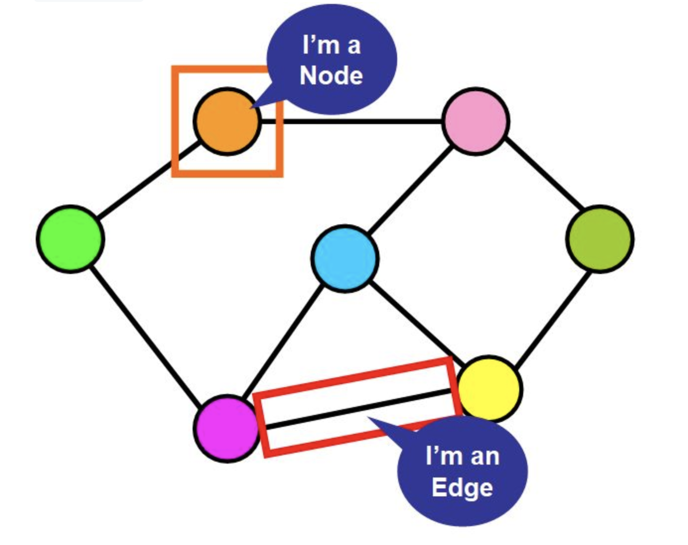
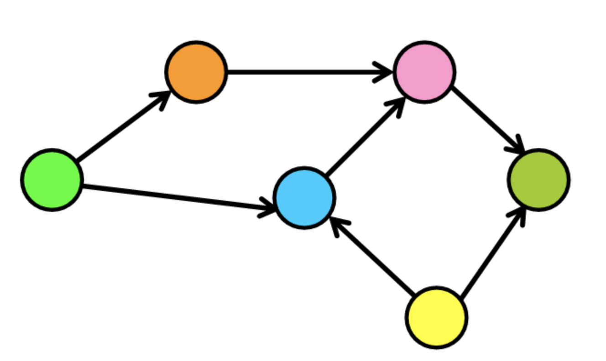
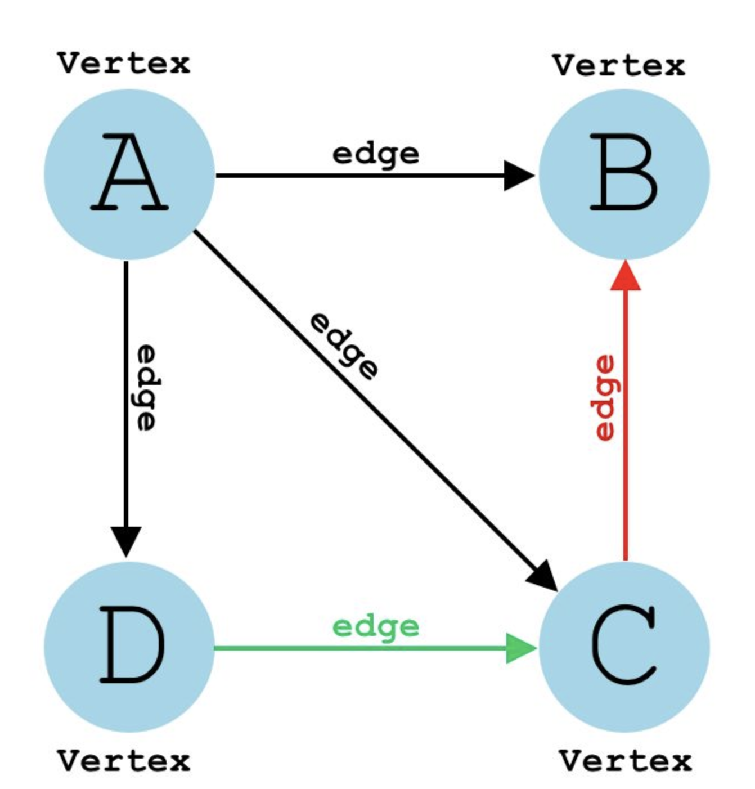

# 图(Graphs)

图是由具有边的节点集合组成的数据结构，图可以是定向的或不定向的。因此图可以分为好多种类，这里不一一讲解，主要看图的应用场景：

- LBS 地图服务以及 GPS 系统

- 社交媒体网站的用户关系图

- 前端工程化中的开发依赖图

- 搜索算法使用图，保证搜索结果的相关性

- 寻找降低运输和交付货物和服务成本的最佳途径

图也是应用最广泛的数据结构之一，真实场景中处处有图。更多概念还是需要读者先进行了解，尤其是图的几种基本元素：

- 节点 Node，比如地铁站中某个站/多个村庄中的某个村庄/互联网中的某台主机/人际关系中的人

- 边 Edge，比如地铁站中两个站点之间的直接连线, 就是一个边



- |V| 图中顶点（节点）的总数

- |E| 图中的连接总数（边）



在上面的示例中 `|V| = 6 |E| = 7`

## 图的实现和遍历

这里我们主要实现一个有向图，Graph 类：

```js
class Graph {
 constructor() {
   this.AdjList = new Map()
 }
}
```

使用 Map 数据结构表述图中顶点关系。

实现方法：

- 添加顶点：addVertex

- 添加边：addEdge

- 打印图：print

- 广度优先算法遍历

- 深度优先算法

addVertex 方法：

```js
addVertex(vertex) {
 if (!this.AdjList.has(vertex)) {
   this.AdjList.set(vertex, [])
 } else {
   throw 'vertex already exist!'
 }
}
```

创建顶点：

```js
let graph = new Graph();
graph.addVertex('A')
graph.addVertex('B')
graph.addVertex('C')
graph.addVertex('D')
```

其中 A、B、C、D 顶点都对应一个数组：

```js
Map {
  'A' => [],
  'B' => [],
  'C' => [],
  'D' => []
}
```

之所以都为空数组 '[]'，是因为数组中需要储存边(Edge)的关系。



我们设计图预计得到如下关系：

```js
Map {
 'A' => ['B', 'C', 'D'],
 'B' => [],
 'C' => ['B'],
 'D' => ['C']
}
```

根据此描述，其实已经可以把图画出来了。addEdge 因此需要两个参数：一个是顶点，一个是连接对象 Node：

```js
addEdge(vertex, node) {
  // 向顶点添加边之前，必须验证该顶点是否存在
  if (this.AdjList.has(vertex)) {
    // 确保添加的边尚不存在
    if (this.AdjList.has(node)){
      let arr = this.AdjList.get(vertex)
      // 如果都通过，那么可以将边添加到顶点
      if(!arr.includes(node)){
        arr.push(node)
      }
    }else {
      throw `Can't add non-existing vertex ->'${node}'`
    }
  } else {
    throw `You should add '${vertex}' first`
  }
}
```

理清楚数据关系，我们就可以打印图了，其实就是一个很简单的 for...of 循环：

```js
print() {
  for (let [key, value] of this.AdjList) {
    console.log(key, value)
  }
}
```

剩下的内容就是遍历图了。

**广度优先算法（BFS）**，是一种利用队列实现的搜索算法。对于图，其搜索过程和 「湖面丢进一块石头激起层层涟漪」 类似。换成算法语言，就是从起点出发，对于每次出队列的点，都要遍历其四周的点。

因此 BFS 的实现步骤：

- BFS将起始节点作为参数。（例如 'A'）

- 初始化一个空对象：visited

- 初始化一个空数组：queue，该数组将用作队列。

- 将起始节点标记为已访问（visited = {'A': true}）

- 将起始节点放入队列中。（queue = ['A']）

- 循环直到队列为空

实现：

```js
createVisitedObject() {
  let arr = {}
  for(let key of this.AdjList.keys()) {
    arr[key] = false
  }
  return arr
}

bfs(initialNode) {
  // 创建一个已访问节点的 map
  let visited = this.createVisitedObject()
  // 模拟一个队列
  let queue = []

  // 第一个节点已访问
  visited[initialNode] = true
  // 第一个节点入队列
  queue.push(initialNode)

  while(queue.length) {
    let current = queue.shift()
    console.log(current)

    // 获得该节点的其他节点关系
    let arr = this.AdjList.get(current)

    for (let elem of arr) {
      // 如果当前节点没有访问过
      if (!visited[elem]) {
        visited[elem] = true
        queue.push(elem)
      }
    }
  }
}
```

那么对于**深度优先搜索算法（DFS）**，我把它总结为：「不撞南墙不回头」，从起点出发，先把一个方向的点都遍历完才会改变方向。换成程序语言就是：「DFS 是利用递归实现的搜索算法」。

因此 DFS 过程：

- 接受起点作为参数 dfs(initialNode)

- 创建访问对象 let visited = this.createVisitedObject()

- 调用辅助函数递归起始节点和访问对象 this.dfsHelper(initialNode, visited)。

- dfsHelper 将其标记为已访问并打印出来。

实现代码：

```js
createVisitedObject() {
  let arr = {}
  for (let key of this.AdjList.keys()) {
    arr[key] = false
  }
  return arr
}

dfs(initialNode) {
  let visited = this.createVisitedObject()
  this.dfsHelper(initialNode, visited)
}

dfsHelper(node, visited) {
  visited[node] = true
  console.log(node)

  let arr = this.AdjList.get(node)

  for (let elem of arr) {
    if (!visited[elem]) {
      this.dfsHelper(elem, visited)
    }
  }
}
```

BFS 的重点在于队列，而 DFS 的重点在于递归，这是它们的本质区别。
