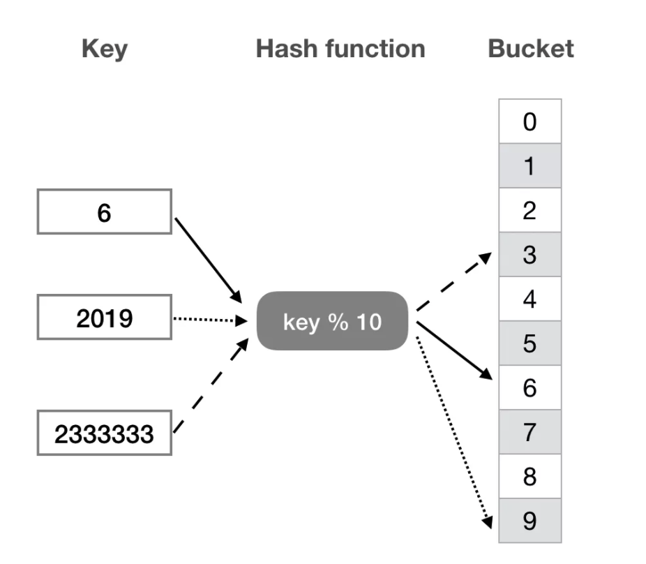
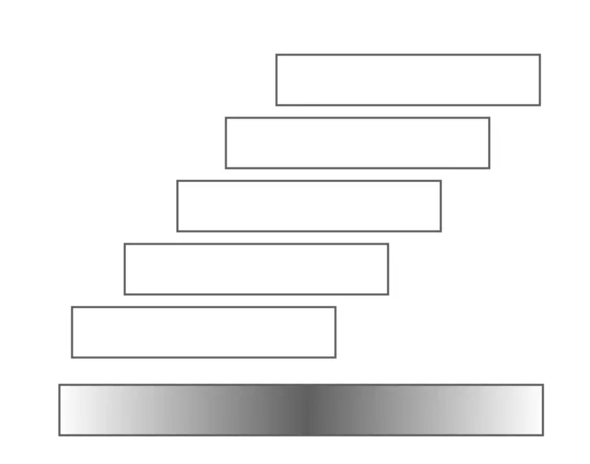
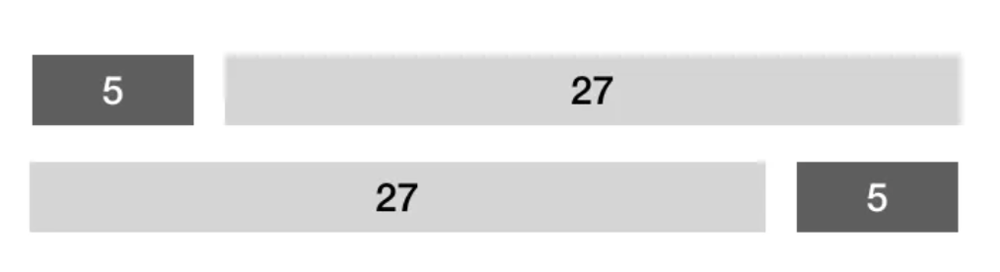
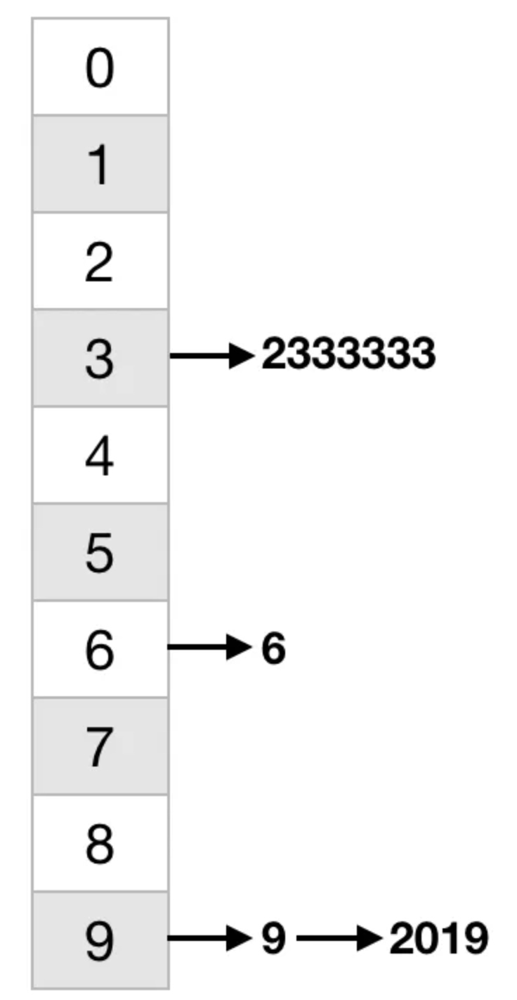

# 散列表（哈希表） HashTables

散列表是一种以 key-value 形式存储数据的数据结构，可以把散列表理解为一种高级的数组，这种数组的下标可以是很大的整数，浮点数，字符串甚至结构体。这种数据结构非常有用，js 里的 Map/Set/WeakMap/WeakSet 在 v8 里都是通过散列表来实现的，再比如 LRU Cache、数据库索引等非常多的场景也都能看到散列表的身影。

散列并不仅仅是一种技术，从某种意义上讲，它甚至是一种思想。接下来让我们一起揭开散列表神秘的面纱。

假如，我们要存储 key 为 6、2019、2333333 的三组数据，如果用数组来存，至少需要一个长度为 2333333 的数组来做这件事情，显然这种做法存在大量的空间浪费。

我们也可以像下图一样，准备一个长度为 10 的数组（bucket array），将每一个 key 通过一个散列函数（hash function），映射到桶数组中的一位，将 key 相应的值直接存入即可。可以看到这种方式只需使用一个长度为 10 的数组，同时查找和插入的时间复杂度都是 O(1)。这就是散列表的核心思想。



散列表中的几个概念：

- 桶（bucket），用来直接存放或间接指向一个数据

- 桶数组（bucket array）由桶组成的数组

- 散列函数（hash function）将 key 转换为桶数组下标的函数

上面的例子比较简单，如果我们继续在之前的基础上再存储一个 key 为 9 的数据，通过 9 % 10 计算得出的也是落在下标为 9 的 bucket 上，此时有两个不同的 key 落在了同一个 bucket 上，这一现象被称为散列冲突。

散列冲突理论上是不可避免的，我们能做的优化主要从以下两个方面入手：

- 精心设计桶数组长度及散列函数，尽可能降低冲突的概率

- 发生冲突时，能对冲突进行排解

假设不用散列表直接用数组来存储需要的数组长度为 R，用散列表存储需要的桶数组长度为 M，需要存储的元素个数为 N，则一定存在以下关系 N < M < R，只有这样散列表才能既保持操作的高效同时起到节省空间的效果。

其中，N / M 称为散列表的装载因子，当装载因子超过一定的阈值时，需要对桶数组扩容并 rehash。

理想的散列函数遵循以下的设计原则：

- 确定：同一 key 总是被映射至同一地址

- 高效：插入/查找/删除 `excepted-O(1)` 时间复杂度

- 满射：尽可能充分地覆盖整个桶数组空间

- 均匀：key 映射到桶数组各位置的概率尽量接近

常用的散列函数如下。

## 除余法

`hash(key) = key % M`，直接对 key 按桶数组的长度取余，这种方法非常简单，但存在以下缺陷。

- 存在不动点：无论桶数组长度 M 取何值，总有 `hash(0) = 0`，这与任何元素都有均等的概率被映射到任何位置的原则相违背。

- 零阶均匀：`[0, R)` 的关键码，平均分配至 M 个桶；但相邻关键码的散列地址也必相邻。

## MAD 法 multiply-add-divide

`hash(key) = (a x key + b) % M`，跟除余法相比，引入的变量 b 可以视作偏移量，可有效的消除不动点，另一个变量 a 扮演着步长的角色，也就是说原本相邻的关键码在经过散列后步长为 a，从而不再继续相邻。

## 平方取中 mid-square

取 `key^2` 的中间若干位，构成地址：

- `hash(123) = 512 // 保留 key^2 = 123^2 = 15219 的中间 3 位`

- `hash(1234567) = 556 // 1234567^2 = 1524155677489`

我们可以将一个数的平方运算，分解为一系列的左移操作以及若干次加法，从下图中不难看出，每一个数位都是由原关键码中的若干数位经求和得到的，因此两侧的数位由更少的原数位求和而得，越是居中的数位，则是由更多的原数位积累而得，因此截取居中的若干位，可使得原关键码的各数位都能对最终结果产生影响，从而实现更好的均匀性



## 多项式法

在实际应用中，我们的 key 不一定都是整数形式，因此往往需要一个预处理将其转换为散列码(hashcode)，然后才可以对其进一步处理为桶数组的下标地址。整个过程可以描述为 key → hashcode → bucket addr，多项式法就是一种有效的将字符串 key 转换为 hashcode 的方法，对于一个长度为 n 的字符串，其计算过程如下：

```js
hash(x0 x1 ... xn-1) = x0 * a^(n-1) + x1 * a^(n-2) ... + xn-2 * a + xn-1
// 如果上面的不是很理解，它其实等价于下面这样
(...((x0 * a + x1) * a + x2) * a + ... xn-2) * a + xn-1)
```

这个多项式可以在 O(n) 而不是 O(n2) 的时间复杂度内计算出结果，具体证明的过程这里就不详细展开了。

在实际的工程中会采用如下这种近似多项式，但更快捷的做法：

```js
function hash(key) {
   let h = 0
   for (let n = key.length, i = 0; i != n; i++) {
       h = (h << 5 | h >> 27)
       h += key[i].charCodeAt()
   }
   return h >>> 0
}
```

通过一个循环依次处理字符串的每一个字符，对于每一个字符将它转换为整数后累加，在累加之前对原有的累积值，都按照 h << 5 | h >> 27 这样的规则做一个数位变换



这一不断调整累加的过程，实际上可以是作为是对以上多项式计算的近似，只不过这里消除掉了相对耗时的乘法运算，至于如何理解和解释这种近似的效果，可以作为本文课后的一项作业。

除了上文讲到的方法外，还有非常多的散列函数的方法，如折叠法、位异或法、（伪）随机数法，此类方法林林总总，每种方法都有各自的特点及应用的场景，由于篇幅原因这里就不再展开了，感兴趣的读者可以在读者群中继续研究和探讨。

总之散列函数产生的关键码越是随机，越是没有规律就越好。

## 冲突解决方法

主要的处理散列表冲突的方法有开链法和探测法这两类。

- 开链法（linked-list chaining / seperate chaining）

每个桶存放一个指针，将冲突的 key 以链表的形式组织起来，这种处理方式最大的优点是能解决任意次数的冲突，但缺点也很明显，最极端的情况所有的 key 数据都落在一个桶上时，散列表将退化为一个链表，查找插入删除的复杂度都将变成 O(n)。



- 探测法（open addressing / closed hashing）

探测法所有的冲突都在这块连续的空间中加以排解，而不用像开链法那样申请额外的空间。当存入一个 key 时，所有的桶都按照某种优先级关系排成一个序列，从本该属于该 key 的桶出发，顺次查看每一个桶直到找到可用的桶。每个 key 对应的这样的一个序列，称为试探序列或者查找链，在查找 key 时，沿查找链查找有两种结果，在桶中找到了查询的 key 也就是查找成功，还有的一种可能是找到一个空桶，则说明查找失败，没有这个 key。

最简单的试探序列的生成方法叫做线性试探（Linear probing），具体做法是一旦发生冲突，则试探后一个紧邻的桶单元，直到成功或失败。这种做法的优点是无需附加的（指针、链表等）空间，缺点也很明显，以往的冲突会导致后续的冲突。

```js
[hash(key) + 1] % M
[hash(key) + 2] % M
[hash(key) + 3] % M
...
```

线性试探的问题根源在于大部分的试探位置都集中在某一个相对较小的局部，因此优化线性试探的方式就是适当的拉开各次探测的间距，平方试探（Quadratic Probing）就是基于这一优化思路的具体实现方式，所谓平方试探顾名思义就是以平方数为距离，确定下一试探桶单元。

```js
[hash(key) + 1^2] % M
[hash(key) + 2^2] % M
[hash(key) + 3^2] % M
...
```

相对于线性试探，平方探测的确可以在很大程度上缓解数据聚集的现象，查找链上，各桶间距线性递增，一旦冲突，可从没地跳是非之地。

## 散列表的实现

最后用 JavaScript 来模拟实现一下 hashtable，这里我们采用开链法来解决散列的冲突。

```js
// 单向链表节点
class ForwardListNode {
 constructor(key, value) {
  this.key = key
  this.value = value
  this.next = null
 }
}

class Hashtable {
  constructor(bucketSize = 97) {
    this._bucketSize = bucketSize
    this._size = 0
    this._buckets = new Array(this._bucketSize)
  }

  hash(key) {
    let h = 0
    for (let n = key.length, i = 0; i != n; i++) {
      h = (h << 5 | h >> 27)
      h += key[i].charCodeAt()
    }
    return (h >>> 0) % this._bucketSize
  }

  // Modifiers
  put(key, value){
    let index = this.hash(key);
    let node = new ForwardListNode(key, value)

    if (!this._buckets[index]) {
      // 如果桶是空的，则直接把新节点放入桶中即可
      this._buckets[index] = node
    } else {
      // 如果桶不为空，则在链表头插入新节点
      node.next = this._buckets[index]
      this._buckets[index] = node
    }
    this._size++
    return index
  }  

  delete(key) {
    let index = this.hash(key)
    if (!this._buckets[index]) {
      return false
    }

    // 添加一个虚拟头节点，方便后面的删除操作
    let dummy = new ForwardListNode(null, null)
    dummy.next = this._buckets[index]
    let cur = dummy.next, pre = dummy
    while (cur) {
      if (cur.key === key) {
        // 从链表删除该节点
        pre.next = cur.next
        cur = pre.next
        this._size--
      } else {
        pre =  cur
        cur = cur.next
      }
    }
    this._buckets[index] = dummy.next
    return true
  }

  // Lookup
  find(key){
    let index = this.hash(key);
    // 如果对应的 bucket 为空，说明不存在此 key
    if (!this._buckets[index]) {
      return null
    }

    // 遍历对应桶的链表
    let p = this._buckets[index]
    while (p) {
      // 找到 key
      if (p.key === key) {
        return p.value
      }
      p = p.next
    }
    return null
  }

  // Capacity
  size() {
    return this._size
  }

  isEmpty() {
    return this._size == 0
  }
}
```
