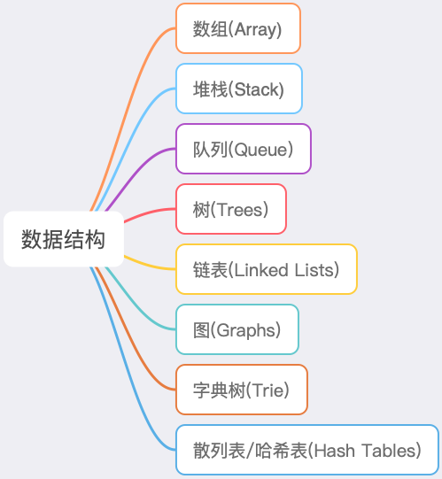

# 前端数据结构

## 八大常见的数据结构

在较高的层次上，基本上有三种类型的数据结构:

- 堆栈和队列是类似于数组的结构，仅在项目的插入和删除方式上有所不同。

- 链表，树，和图 结构的节点是引用到其他节点。

- 散列表依赖于散列函数来保存和定位数据。

在复杂性方面：

- 堆栈和队列是最简单的，并且可以从中构建链表。

- 树和图 是最复杂的，因为它们扩展了链表的概念。

- 散列表和字典树 需要利用这些数据结构来可靠地执行。

就效率而已：

- 链表是记录和存储数据的最佳选择

- 而哈希表和字典树 在搜索和检索数据方面效果最佳。

## [堆栈 Stack](stack.md)

## [队列 Queue](queue.md)

## [树 Trees](trees.md)

## [链表 LinkedLists](linked-lists.md)

## [图 Graphs](graphs.md)

## [字典树 Trie](trie.md)

## [散列表 / 哈希表 HashTables](hash-tables.md)