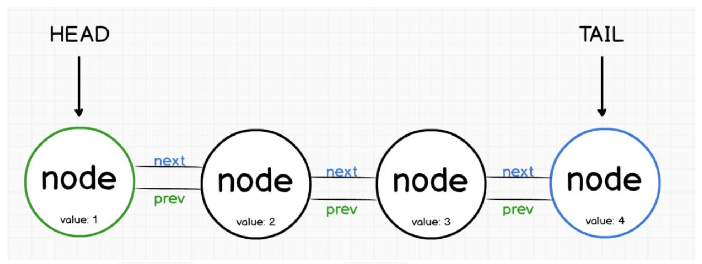

# 链表(LinkedLists)

与数组一样，链表是按顺序存储数据元素，不同的地方在于链表不能像数组一样通过下标访问，而是每一个元素指向下一个元素。



第一个节点称为头部(head)，而最后一个节点称为尾部(tail)

直观上我们就可以得出结论：链表不需要一段连续的存储空间，「指向下一个元素」的方式能够更大限度地利用内存。

## 链表的优点

- 链表的插入和删除操作的时间复杂度是常数级的，我们只需要改变相关节点的指针指向即可；

- 链表可以像数组一样顺序访问，查找元素的时间复杂度是线性的。

实现链表，我们需要先对链表进行分类，常见的有：

- 单链表：单链表是维护一系列节点的数据结构，其特点是：每个节点包含了数据，同时包含指向链表中下一个节点的指针。

- 双向链表：不同于单链表，双向链表特点：每个节点分除了包含其数据以外，还包含了分别指向其前驱和后继节点的指针。

## 链表应用场景

- 在客户端上，像 Redux就以链表方式构建其中的逻辑;

- React 核心算法 React Fiber的实现就是链表;

- 在服务器上，像 Express 这样的 Web 框架也以类似的方式构建其中间件逻辑。当请求被接收时，它从一个中间件管道输送到下一个，直到响应被发出;

## 双向链表实现思路

```js
// 节点构造函数（节点类）
class Node {
  constructor(data) {
    // data 为当前节点所储存的数据
    this.data = data
    // next 指向下一个节点
    this.next = null
    // prev 指向前一个节点
    this.prev = null
  }
}

class DoublyLinkedList {
  constructor() {
    // 双向链表开头
    this.head = null
    // 双向链表结尾
    this.tail = null
  }

  // 在链表尾部添加一个新的节点
  add(item) {
    // 实例化一个节点
    let node = new Node(item)

    // 如果当前链表还没有头
    if(!this.head) {
      this.head = node
      this.tail = node
    }
    // 如果当前链表已经有了头，只需要在尾部加上该节点
    else {
      node.prev = this.tail
      this.tail.next = node
      this.tail = node
    }
  }

  // 在链表指定位置添加一个新的节点
  addAt(index, item) {
    let current = this.head
    // 维护查找时当前节点的索引
    let counter = 1
    let node = new Node(item)

    // 如果在头部插入
    if (index === 0) {
      this.head.prev = node
      node.next = this.head
      this.head = node
    }
    // 非头部插入，需要从头开始，找寻插入位置
    else {
      while(current) {
        current = current.next
        if( counter === index) {
          node.prev = current.prev
          current.prev.next = node
          node.next = current
          current.prev = node
        }
        counter++
      }
    }
  }

  // 删除链表指定数据项节点
  remove(item) {
    let current = this.head

    while (current) {
          // 找到了目标节点
      if (current.data === item ) {
        // 目标链表只有当前目标项，即目标节点即是链表头又是链表尾
        if (current == this.head && current == this.tail) {
          this.head = null
          this.tail = null
        }
        // 目标节点为链表头
        else if (current == this.head ) {
          this.head = this.head.next
          this.head.prev = null
        }
        // 目标节点为链表尾部
        else if (current == this.tail ) {
          this.tail = this.tail.prev;
          this.tail.next = null;
        }
        // 目标节点在链表收尾之间，中部
        else {
          current.prev.next = current.next;
          current.next.prev = current.prev;
        }
      }
      current = current.next
    }
  }

  // 删除链表指定位置节点
  removeAt(index) {
    // 都是从「头」开始遍历
    let current = this.head
    let counter = 1

    // 删除链表头部
    if (index === 0 ) {
      this.head = this.head.next
      this.head.prev = null
    }
    else {
      while(current) {
      current = current.next
      // 如果目标节点在链表尾
      if (current == this.tail) {
        this.tail = this.tail.prev
        this.tail.next = null
      }
      else if (counter === index) {
        current.prev.next = current.next
        current.next.prev = current.prev
        break
      }
      counter++
      }
    }
  }

  // 翻转链表
  reverse() {
    let current = this.head
    let prev = null

    while (current) {
      let next = current.next

      // 前后倒置
      current.next = prev
      current.prev = next

      prev = current
      current = next
    }

    this.tail = this.head
    this.head = prev
  }
  // 交换两个节点数据
  swap(index1, index2) {
    // 使 index1 始终小于 index2，方便后面查找交换
    if (index1 > index2) {
      return this.swap(index2, index1)
    }

    let current = this.head
    let counter = 0
    let firstNode

    while(current !== null) {
      // 找到第一个节点，先存起来
      if (counter === index1 ){
          firstNode = current
      }

      // 找到第二个节点，进行数据交换
      else if (counter === index2) {
        // ES 提供了更简洁交换数据的方法，这里我们用传统方式实现，更为直观
        let temp = current.data
        current.data = firstNode.data
        firstNode.data = temp
      }

      current = current.next
      counter++
    }
    return true
  }
  // 查询链表是否为空
  isEmpty() {
    return this.length() < 1
  }
  // 查询链表长度
  length() {
    let current = this.head
    let counter = 0
    while(current !== null) {
      counter++
      current = current.next
    }
    return counter
  }
  // 遍历链表
  traverse(fn) {
    let current = this.head
    while(current !== null) {
      fn(current)
      current = current.next
    }
    return true
  }
  // 查找某个节点的索引
  search(item) {
    let current = this.head
    let counter = 0

    while( current ) {
      if( current.data == item ) {
        return counter
      }
      current = current.next
      counter++
    }
    return false
  }
}
```
