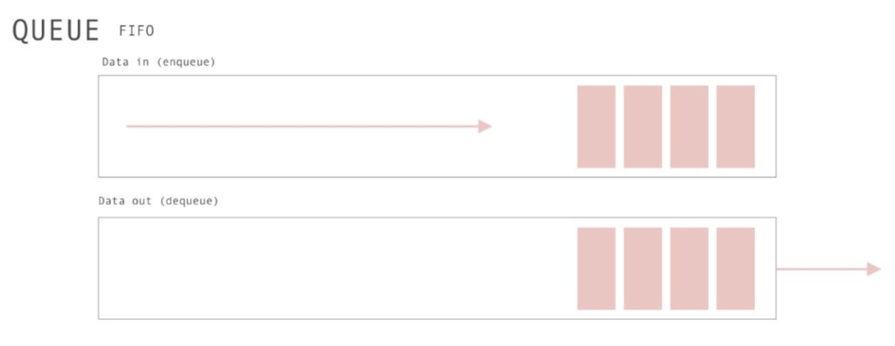

# 队列(Queue)

队列的实现遵循先进先出 FIFO（First in、First out）：



## 队列实际应用

- 在前端开发中，最著名的队列使用当属浏览器/NodeJs中 关于宏任务与微任务，任务队列的知识；

- 后端也应用广泛，如消息队列、RabbitMQ、ActiveMQ 等，能起到延迟缓冲的功效；

```js
class Queue {
  constructor(...args) {
    this.queue = [...args]
  }

  // Modifiers
  enqueue(...items) {
    return this.queue.push(... items)
  }

  dequeue() {
    return this.queue.shift()
  }

  // Element access
  front() {
    return this.isEmpty()
        ? undefined
        : this.queue[0]
  }

  back() {
    return this.isEmpty()
        ? undefined
        : this.queue[this.size() - 1]
  }

  // Capacity
  isEmpty() {
    return this.size() == 0
  }

  size() {
    return this.queue.length
  }
}
```
