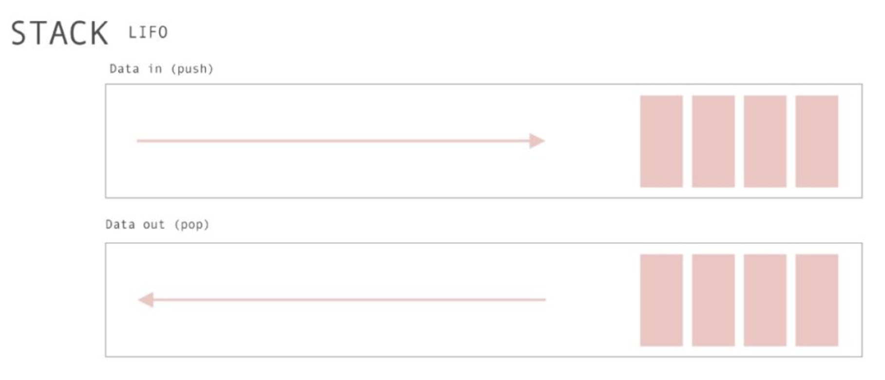

# 堆栈(Stack)

堆栈的实现遵循后进先出 LIFO（Last in、First out）：



## 堆栈实际应用

- 浏览器的历史记录，因为回退总是回退「上一个」最近的页面，它需要遵循栈的原则；

- 类似浏览器的历史记录，任何 undo/redo 都是一个栈的实现；

- 在代码中，广泛应用的递归产生的调用栈，同样也是栈思想的体现，想想我们常说的「栈溢出」就是这个道理；

- 同上，浏览器在抛出异常时，常规都会抛出调用栈信息；

- 在计算机科学领域应用广泛，如进制转换、括号匹配、栈混洗、表达式求值等；

## 堆栈实现

```js
class Stack {
  constructor(...args) {
    this.stack = [...args]
  }

  // Modifiers
  // 向stack中添加元素
  push(...items) {
    return this.stack.push(...items)
  }

  // 返回栈顶元素,并且将该栈顶元素出栈
  pop() {
    return this.stack.pop()
  }

  // Element access
  // 返回栈顶元素
  peek() {
    return this.isEmpty()
        ? undefined
        : this.stack[this.size() - 1]
  }

  // Capacity
  isEmpty() {
    return this.size() == 0
  }

  size() {
    return this.stack.length
  }
}
```
