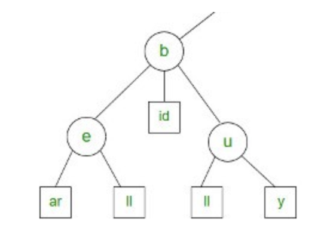
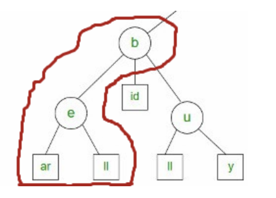

# 字典树(Trie)

Trie（通常发音为“try”）是针对特定类型的搜索而优化的树数据结构。当你想要获取部分值并返回一组可能的完整值时，可以使用 Trie。典型的例子是自动完成。

Trie，是一种搜索树，也称字典树或单词查找树，此外也称前缀树，因为某节点的后代存在共同的前缀。

## 字典树的特点

- key都为字符串，能做到高效查询和插入，时间复杂度为 O(k)，k为字符串长度

- 缺点是如果大量字符串没有共同前缀时很耗内存。

- 它的核心思想就是减少没必要的字符比较，使查询高效率。

- 即用空间换时间，再利用共同前缀来提高查询效率。

例如： 搜索前缀 “b” 的匹配将返回6个值： be， bear， bell， bid， bull， buy。



搜索前缀 “be” 的匹配将返回2个值： bear，bell



## 字典树的应用

只要你想要将前缀与可能的完整值匹配，就可以使用 Trie。

现实中多运用在：

- 自动填充/预先输入

- 搜索

- 输入法选项

- 分类

也可以运用在：

- IP地址检索

- 电话号码

## 字典树的实现和遍历

```js
class PrefixTreeNode {
  constructor(value) {
    // 存储子节点
    this.children = {}
    this.isEnd = null
    this.value = value
  }
}

class PrefixTree extends PrefixTreeNode {
  constructor() {
    super(null)
  }

  // 创建一个字典树节点
  addWord(str) {
    const addWordHelper = (node, str) => {
      // 当前 node 不含当前 str 开头的目标
      if (!node.children[str[0]]) {
          // 以当前 str 开头的第一个字母，创建一个 PrefixTreeNode 实例
          node.children[str[0]] = new PrefixTreeNode(str[0])
      }
      if (str.length === 1) {
        node.children[str[0]].isEnd = true
      }
      else if (str.length > 1) {
          addWordHelper(node.children[str[0]], str.slice(1))
      }
    }
    addWordHelper(this, str)
  }

  // 给定一个字符串，返回字典树中以该字符串开头的所有单词
  predictWord(str) {
    let getRemainingTree = function(str, tree) {
      let node = tree
      while (str) {
        node = node.children[str[0]]
        str = str.substr(1)
      }
      return node
    }

    // 该数组维护所有以 str 开头的单词
    let allWords = []

    let allWordsHelper = function(string, tree) {
      for (let k in tree.children) {
        const child = tree.children[k]
        let newString = string + child.value
        if (child.isEnd) {
          allWords.push(newString)
        }
        allWordsHelper(newString, child)
      }
    }

    let remainingTree = getRemainingTree(str, this)

    if (remainingTree) {
      allWordsHelper(str, remainingTree)
    }

    return allWords
  }
}
```
