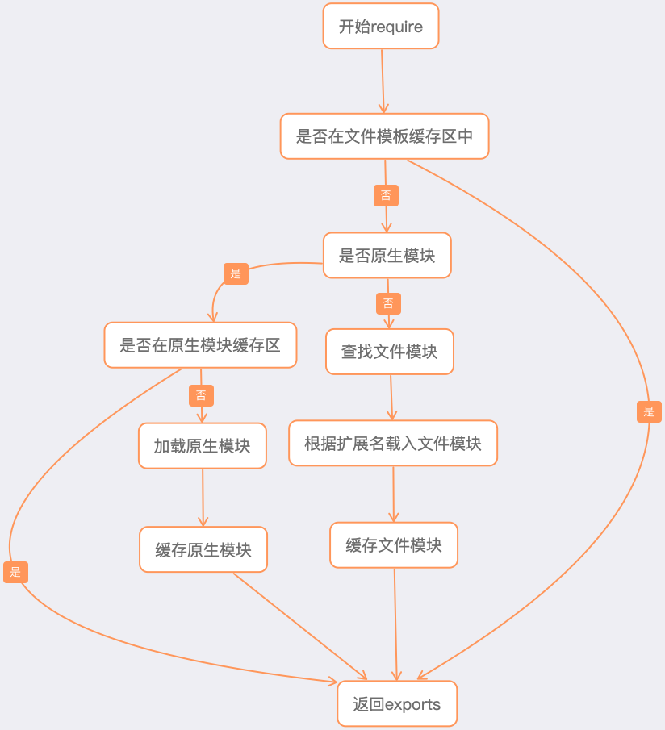

# 前端模块化

## 模块

何谓模块？且看 webpack 中定义：

> 在模块化编程中，开发者将程序分解成离散功能块(discrete chunks of functionality)，并称之为模块。每个模块具有比完整程序更小的接触面，使得校验、调试、测试轻而易举。 精心编写的模块提供了可靠的抽象和封装界限，使得应用程序中每个模块都具有条理清楚的设计和明确的目的。

模块应该是职责单一、相互独立、低耦合的、高度内聚且可替换的离散功能块。

## 模块化

何谓模块化？

> 模块化是一种处理复杂系统分解成为更好的可管理模块的方式，它可以把系统代码划分为一系列职责单一，高度解耦且可替换的模块，系统中某一部分的变化将如何影响其它部分就会变得显而易见，系统的可维护性更加简单易得。

模块化是一种分治的思想，通过分解复杂系统为独立的模块实现细粒度的精细控制，对于复杂系统的维护和管理十分有益。模块化也是组件化的基石，是构成现在色彩斑斓的前端世界的前提条件。

## 为什么需要模块化

前端开发和其他开发工作的主要区别，首先是前端是基于多语言、多层次的编码和组织工作，其次前端产品的交付是基于浏览器，这些资源是通过增量加载的方式运行到浏览器端，如何在开发环境组织好这些碎片化的代码和资源，并且保证他们在浏览器端快速、优雅的加载和更新，就需要一个模块化系统，这个理想中的模块化系统是前端工程师多年来一直探索的难题。

前端模块化发展主要经历了三个阶段：

- 早期「假」模块化时代

- 规范标准时代

- ES 原生时代

这些阶段逐次递进，每一种新方案的诞生，都离不开老方案的启示。

## 早期「假」模块化时代

在早期，JavaScript 属于运行在浏览器端的玩具脚本，它只负责实现一些简单的交互。随着互联网技术的演进，这样的设计逐渐不能满足业务的需求。这时候开发者往往从代码可读性上，借助函数作用域来模拟实现「假」的模块化，我称其为函数模式，即将不同功能封装成不同的函数：

```js
function f1(){
   //...
}
function f2(){
   //...
}
```

这样的方式其实根本不算模块化，各个函数在同一个文件中，混乱地互相调用，而且存在命名冲突的风险。这没有在根本上解决问题，只是从代码编写的角度，拆分成了更小的函数单元而已。

于是，聪明的开发者很快就想出了第二种方式，姑且称它为对象模式，即利用对象，实现命名空间的概念：

```js
const module1 = {
   foo: 'bar',
   f11: function f11 () { //... },
   f12: function f12 () { //... },
}

const module2 = {
   data: 'data',
   f21: function f21 () { //... },
   f22: function f22 () { //... },
}
```

这样我们模拟了简单的 module1、module2 命名空间，在函数主体中可以调用：

```js
module1.f11()
console.log(module2.data)
```

可是这样问题也很明显，module1 和 module2 中的数据并不安全，任何开发者都可以修改：

```js
module2.data = 'modified data'
```

对象内部成员可以随意被改写，极易出现 bug。那么有什么手段能弥补这个不足呢？

想一想之前关于闭包的课程，从某种角度上看，闭包简直就是一个天生解决数据访问性问题的方案。通过立即执行函数（IIFE），我们构造一个私有的作用域，再通过闭包，将需要对外暴露的数据和接口输出，我们称此为 IIFE 模式。立即执行函数结合闭包实现的代码如下：

```js
const module = (function(){
   var foo = 'bar'
   var fn1 = function (){
       // ...
   }
   var fn2 = function fn2(){
       // ...
   }
   return {
       fn1: fn1,
       fn2: fn2
   }
})()
```

我们在调用时：

```js
module.fn1()
```

如果想要访问变量 foo：

```js
module.foo
// undefined
```

是访问不到具体数据的。 ​

了解了这种模式，我们可以在此基础上「玩出另外一个花」来，该方式的变种：结合顶层 window 对象，我们再来看：

```js
(function(window) {
   var data = 'data'

   function foo() {
       console.log(`foo executing, data is ${data}`)
   }
   function bar() {
       data = 'modified data'
       console.log(`bar executing, data is now ${data} `)
   }
   window.module1 = { foo, bar }
})(window)
```

这样的实现，数据 data 完全做到了私有，外界无法修改 data 值。那么如何访问 data 呢？这时候需要模块内部设计并暴露相关接口。上述代码中，只需要调用模块 module1 暴露给外界（window）的函数即可:

```js
module1.foo()
// foo executing, data is data
```

修改 data 值的途径，也只能由模块 module1 提供：

```js
module1.bar()
// bar executing, data is now modified data
```

如此一来，已经初具「模块化」的实质，实现了模块化所应该具备的初级功能。

我们再进一步思考，如果 module1 依赖外部模块 module2，该怎么办？请参考代码：

```js
(function(window, $) {
   var data = 'data'

   function foo() {
       console.log(`foo executing, data is ${data}`)
       console.log($)
   }
   function bar() {
       data = 'modified data'
       console.log(`bar executing, data is now ${data} `)
   }
   window.module1 = { foo, bar }
})(window, jQuery)
```

事实上，这就是现代模块化方案的基石。到此为止，我们经历了模块化的第一阶段：「假」模块化时代。这种实现极具阿 Q 精神，它并不是语言原生层面上的实现，而是开发者利用语言，借助 JavaScript 特性，模拟了类似的功能，为后续方案打开了大门。请继续阅读。

## 规范标准时代 CommonJS

Node.js 无疑对前端的发展具有极大的促进作用，它带来的 CommonJS 模块化规范像一股「改革春风」：在 Node.js 中，每一个文件就是一个模块，具有单独的作用域，对其他文件是不可见的。关于 CommonJS 的规范，我们这里不做过多介绍，基础内容读者可自行理解，我们只来看看它的几个容易被忽略的特点。

- 文件即模块，文件内所有代码都运行在独立的作用域，因此不会污染全局空间。

- 模块可以被多次引用、加载。在第一次被加载时，会被缓存，之后都从缓存中直接读取结果。

- 加载某个模块，就是引入该模块的 `module.exports` 属性。

- `module.exports` 属性输出的是值的拷贝，一旦这个值被输出，模块内再发生变化不会影响到输出的值。

- 模块加载顺序按照代码引入的顺序。

- 注意 `module.exports` 和 `exports` 的区别 [参见](https://www.jianshu.com/p/2f8d097a681a)

CommonJS 对模块的定义可分为三部分：模块引用（require）、模块定义（exports、module.exports）、模块标识（require参数）。

require的模块加载机制:



### 手写 CommonJS

```js
const path = require('path')
const fs = require('fs')
const vm = require('vm')

// 定义Module
function Module(id){
  this.id = id
  this.filename = id
  this.exports = {}
  this.loaded = false
}

// 定义拓展与解析规则
Module._extensions = Object.create(null)

Module._extensions['.json'] = function(module){
  return Module.exports = JSON.parse(fs.readFileSync(module.filename, 'utf8'))
}

Module._extensions['.js'] = function(module){
  Module._compile(moudle)
}

// 包装函数
Module.wrap = function(script) {
  return Module.wrapper[0] + script + Module.wrapper[1];
};

Module.wrapper = [
  '(function (exports, require, module, __filename, __dirname) { ',
  '\n});'
];

// 编译执行
Module._compile = function(module){
  const content = fs.readFileSync(module.filename, 'utf8'), filename = module.filename;
  const wrapper = Module.wrap(content)

  const compiledWrapper = vm.runInThisContext(wrapper, {
    filename: filename,
    lineOffset: 0,
    displayErrors: true,
  })

  const result = compiledWrapper.call(module.exports, module.exports, require, module, filename, dirname);

  return result
}

// 缓存
Module._cache = Object.create(null)

Module.prototype.load = function(filename){
  let extname = path.extname(filename)
  Module._extensions[extname](this);
  this.loaded = true;
}

// 加载
Module._load = function(filename) {
  const cacheModule = Module._cache[filename]
  
  if(cacheModule){
    return cacheModule.exports
  }

  let module = new Module(filename)
  Module._cache[filename] = module

  module.load(filename)

  return module.exports
}

// 简单的路径解析
Module._resolveFilename = function(path) {
  let p = path.resolve(path)
  if(!/\.\w+$/.test(p)){
    let arr = Object.keys(Module._extensions)
    arr.forEach(item => {
      let file = `${p}${item}`
      try{
        fs.accessSync(file)
        return file
      }catch(e){
        // ...
      }
    })
  }else{
    return p
  }
}

// require 函数
function require(path){
  const filename = Module._resolveFilename(path)
  return Module._load(filename)
}
```

## 规范标准时代 AMD

由于 Node.js 运行于服务器上，所有的文件一般都已经存在了本地硬盘中，不需要额外的网络请求去异步加载，因而 CommonJS 规范加载模块是同步的。只有加载完成，才执行后续操作。但是，如果放在浏览器环境中，我们都需要从服务器端获取模块文件，此时再采用同步的方式，显然就不合适了。这时候，社区上推出了 AMD 规范。

AMD 规范，全称为：Asynchronous Module Definition，看到 「Asynchronous」，我们就能够反映到它的模块化标准不同于 CommonJS，是异步的，完全贴合浏览器的。

它规定了如何定义模块，如何对外输出，如何引入依赖。这一切都需要代码去实现，因此一个著名的库 —— require.js 应运而生，require.js 实现很简单：通过 define 方法，将代码定义为模块；通过 require 方法，实现代码的模块加载。

define 和 require 就是 require.js 在全局注入的函数。[require.js 源码](https://github.com/requirejs/requirejs)

```js
var require, define;
(function (global, setTimeout) {
   // ...
}(this, (typeof setTimeout === 'undefined' ? undefined : setTimeout)));
```

我们看到，require.js 在全局定义了 require 和 define 两个方法，也是利用立即执行函数，将全局对象（this）和 setTimeout 传入函数体内。其中：

```js
define = function (name, deps, callback) {
   // ...
   if (context) {
       context.defQueue.push([name, deps, callback]);
       context.defQueueMap[name] = true;
   } else {
       globalDefQueue.push([name, deps, callback]);
   }
}
```

这里主要是将依赖注入到依赖队列。而 require 的主要作用是完成创建 script 标签去请求相应的模块，对模块进行加载和执行：

```js
req.load = function (context, moduleName, url) {
   var config = (context && context.config) || {},
   node;
   if (isBrowser) {
       //create a async script element
       node = req.createNode(config, moduleName, url);

       //add Events [onreadystatechange,load,error]
       .....

       //set url for loading
       node.src = url;

       //insert script element to head and start load
       currentlyAddingScript = node;
       if (baseElement) {
           head.insertBefore(node, baseElement);
       } else {
           head.appendChild(node);
       }
       currentlyAddingScript = null;

       return node;
   } else if (isWebWorker) {
       .........
   }
};

req.createNode = function (config, moduleName, url) {
   var node = config.xhtml ?
       document.createElementNS('http://www.w3.org/1999/xhtml', 'html:script') :
       document.createElement('script');
   node.type = config.scriptType || 'text/javascript';
   node.charset = 'utf-8';
   node.async = true;
   return node;
};
```

细心的读者可能会有疑问：在我们使用 require.js 之后，并没有发现额外多出来的 script 标签，这个秘密就在于 checkLoaded 方法会把已经加载完毕的脚本删除，因为我们需要的是模块内容，一旦加载之后，没有必要保留有 script 标签了：

```js
function removeScript(name) {
   if (isBrowser) {
       each(scripts(), function (scriptNode) {
           if (scriptNode.getAttribute('data-requiremodule') === name &&
                   scriptNode.getAttribute('data-requirecontext') === context.contextName) {
               scriptNode.parentNode.removeChild(scriptNode);
               return true;
           }
       });
   }
}
```

## 规范标准时代 CMD

CMD 规范整合了 CommonJS 和 AMD 规范的特点。它的全称为：Common Module Definition，类似 require.js，CMD 规范的实现为 sea.js。

AMD 和 CMD 的两个主要区别如下。

- AMD 需要异步加载模块，而 CMD 在 require 依赖的时候，可以通过同步的形式（require），也可以通过异步的形式（require.async）。

- CMD 遵循依赖就近原则，AMD 遵循依赖前置原则。也就是说，在 AMD 中，我们需要把模块所需要的依赖都提前在依赖数组中声明。而在 CMD 中，我们只需要在具体代码逻辑内，使用依赖前，把依赖的模块 require 进来。

## 规范标准时代 UMD

UMD 全称：Universal Module Definition，看到 「Universal」，我们可以猜到它允许在环境中同时使用 AMD 与 CommonJS 规范，相当于一个整合。该模式的核心思想在于利用立即执行函数根据环境来判断需要的参数类别，譬如在 CommonJS 环境下，上述代码会以如下方式执行：

```js
function (factory) {
   module.exports = factory();
}
```

而如果是在 AMD 模块规范下，函数的参数就变成了 define，适用 AMD 规范。

具体代码：

```js
(function (root, factory) {
   if (typeof define === 'function' && define.amd) {
       // AMD 规范
       define(['b'], factory);
   } else if (typeof module === 'object' && module.exports) {
       // 类 Node 环境，并不支持完全严格的 CommonJS 规范
       // 但是属于 CommonJS-like 环境，支持 module.exports 用法
       module.exports = factory(require('b'));
   } else {
       // 浏览器环境
       root.returnExports = factory(root.b);
   }
}(this, function (b) {
   // 返回值作为 export 内容
   return {};
}));
```

至此，我们介绍完了模块化的 Node.js 和社区解决方案。这些方案充分利用了 JavaScript 语言特性，并结合浏览器端的特点，加以实现。不同的实现方式体现了不同的设计哲学，但是它们的最终方向都指向了模块化的几个原则：可复用性、可组合型、中心化、独立性。
