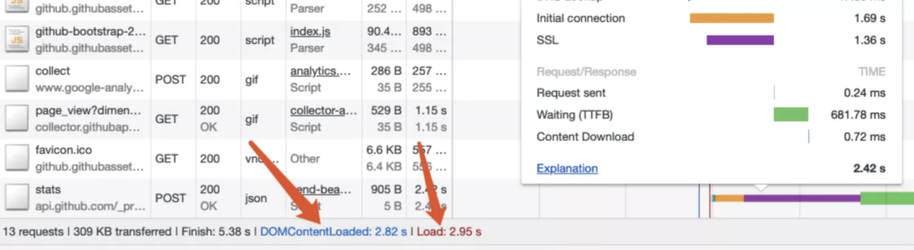
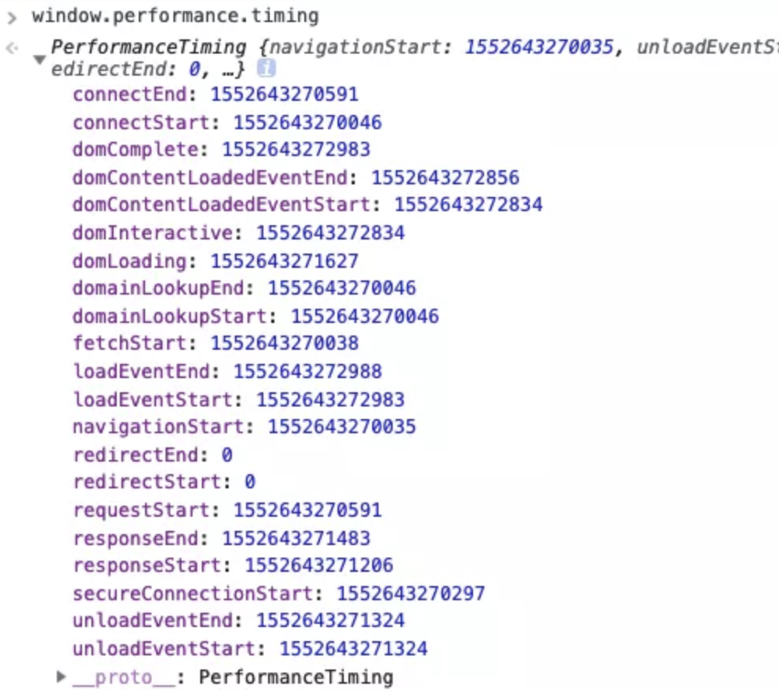

# 性能监控

## 性能监控指标

- **首次绘制（FP）**：对于应用页面，用户在视觉上首次出现不同于跳转之前的内容时间点，或者说是页面发生第一次绘制的时间点。

- **首次有内容绘制（FCP）时间**：指浏览器完成渲染 DOM 中第一个内容的时间点，可能是文本、图像或者其他任何元素，此时用户应该在视觉上有直观的感受。

- **首次有意义绘制（FMP）时间**：指页面关键元素渲染时间。这个概念并没有标准化定义，因为关键元素可以由开发者自行定义——究竟什么是「有意义」的内容，只有开发者或者产品经理自己了解。

- **首屏时间**：对于所有网页应用，这是一个非常重要的指标。用大白话来说，就是进入页面之后，应用渲染完整个手机屏幕（未滚动之前）内容的时间。需要注意的是，业界对于这个指标其实同样并没有确切的定论，比如这个时间是否包含手机屏幕内图片的渲染完成时间。

- **用户可交互（TTI）时间**：顾名思义，也就是用户可以与应用进行交互的时间。一般来讲，我们认为是 domready 的时间，因为我们通常会在这时候绑定事件操作。如果页面中涉及交互的脚本没有下载完成，那么当然没有到达所谓的用户可交互时间。[何谓 domReady](https://www.cnblogs.com/rubylouvre/p/4536334.html)

- **总下载时间**：页面所有资源加载完成所需要的时间。一般可以统计 window.onload 时间，这样可以统计出同步加载的资源全部加载完的耗时。如果页面中存在较多异步渲染，也可以将异步渲染全部完成的时间作为总下载时间。

- **自定义指标**：由于应用特点不同，我们可以根据需求自定义时间。比如，一个类似 Instagram 的页面，页面由图片瀑布流组成，那么我们可能非常关心屏幕中第一排图片渲染完成的时间。

> Google Lighthouse 有将 First Meaningful Paint 和 First Contentful Paint 以及 Time to Interactive（可交互时间）收录其中

这里我们提一下，**DOMContentLoaded 与 load 事件**的区别。其实从这两个事件的命名我们就能体会，DOMContentLoaded 指的是文档中 DOM 内容加载完毕的时间，也就是说 HTML 结构已经完整。但是我们知道，很多页面包含图片、特殊字体、视频、音频等其他资源，这些资源由网络请求获取，DOM 内容加载完毕时，由于这些资源往往需要额外的网络请求，还没有请求或者渲染完成。而当页面上所有资源加载完成后，load 事件才会被触发。因此，在时间线上，load 事件往往会落后于 DOMContentLoaded 事件。

如图：



表示页面加载一共请求了 13 个资源，大小为 309 KB，DOMContentLoaded 时间为 2.82 s，load 时间为 2.95 s，页面完全稳定时间 5.38 s 。

## FMP 的智能获取算法

另外结合自定义指标和首次有意义绘制（FMP）时间，稍做延伸：我们知道首次有意义绘制比较主观，开发者可以自行指定究竟哪些属于有意义的渲染元素。我们也可以通过 FMP 的智能获取算法来完成自定义 FMP 时间。该算法实现过程如下。

**首先**，获取有意义的渲染元素，一般认为：

- 体积占比比较大

- 屏幕内可见占比大

- 属于资源加载元素（img、svg、video、object、embed、canvas）

- 主要元素是多个组成的

具备这几个条件的元素，更像是有意义的元素。根据元素对页面视觉的贡献，我们对元素特点的权重进行划分：

```js
const weightMap = {
  SVG: 2,
  IMG: 2,
  CANVAS: 3,
  OBJECT: 3,
  EMBED: 3,
  VIDEO: 3,
  OTHER: 1
}
```

**接着**，我们对整个页面进行深度优先遍历搜索，之后对每一个元素进行分数计算，具体通过 `element.getBoundingClientRect` 获取元素的位置和大小，然后通过计算「width height weight * 元素在 viewport 的面积占比」的乘积，确定元素的最终得分。接着将该元素的子元素得分之和与其得分进行比较，取较大值，记录得分元素集。这个集合是「可视区域内得分最高的元素的集合」，我们会对这个集合的得分取均值，然后过滤出在平均分之上的元素集合，进行时间计算。这就得到了一个智能的 FMP 时间。

**最终**，代码由 qbright 实现：[fmp-timing](https://github.com/qbright/fmp-timing)，感兴趣的读者可以自行了解细节。

## 性能数据获取

### `window.performance`：强大但有缺点

目前最为流行和靠谱的方案是采用 Performance API，它非常强大：不仅包含了页面性能的相关数据，还带有页面资源加载和异步请求的相关数据。

调用 window.performance.timing 会返回一个对象，这个对象包含各种页面加载和渲染的时间节点。如图：



具体解析：

```js
const window.performance = {
  memory: {
    usedJSHeapSize,
    totalJSHeapSize,
    jsHeapSizeLimit
  },

  navigation: {
    // 页面重定向跳转到当前页面的次数
    redirectCount,
    // 以哪种方式进入页面
    // 0 正常跳转进入
    // 1 window.location.reload() 重新刷新
    // 2 通过浏览器历史记录，以及前进后退进入
    // 255 其他方式进入
    type,
  },

  timing: {
    // 等于前一个页面 unload 时间，如果没有前一个页面，则等于 fetchStart 时间
    navigationStart
    // 前一个页面 unload 时间，如果没有前一个页面或者前一个页面与当前页面不同域，则值为 0
    unloadEventStart,
    // 前一个页面 unload 事件绑定的回调函数执行完毕的时间
    unloadEventEnd,
    redirectStart,
    redirectEnd,
    // 检查缓存前，准备请求第一个资源的时间
    fetchStart,
    // 域名查询开始的时间
    domainLookupStart,
    // 域名查询结束的时间
    domainLookupEnd,
    // HTTP（TCP） 开始建立连接的时间            connectStart,
    // HTTP（TCP）建立连接结束的时间
    connectEnd,
    secureConnectionStart,
    // 连接建立完成后，请求文档开始的时间
    requestStart,
    // 连接建立完成后，文档开始返回并收到内容的时间
    responseStart,
    // 最后一个字节返回并收到内容的时间
    responseEnd,
    // Document.readyState 值为 loading 的时间
    domLoading,
    // Document.readyState 值为 interactive
    domInteractive,
    // DOMContentLoaded 事件开始时间
    domContentLoadedEventStart,
    // DOMContentLoaded 事件结束时间
    domContentLoadedEventEnd,
    // Document.readyState 值为 complete 的时间            domComplete,
    // load 事件开始的时间
    loadEventStart,
    // load 事件结束的时间
    loadEventEnd
  }
}
```

根据这些时间节点，我们选择相应的时间两两做差，便可以计算出一些典型指标：

```js
const calcTime = () => {
  let times = {}
  let t = window.performance.timing

  // 重定向时间
  times.redirectTime = t.redirectEnd - t.redirectStart

  // DNS 查询耗时
  times.dnsTime = t.domainLookupEnd - t.domainLookupStart

  // TCP 建立连接完成握手的时间
  connect = t.connectEnd - t.connectStart

  // TTFB 读取页面第一个字节的时间
  times.ttfbTime = t.responseStart - t.navigationStart

  // DNS 缓存时间
  times.appcacheTime = t.domainLookupStart - t.fetchStart

  // 卸载页面的时间
  times.unloadTime = t.unloadEventEnd - t.unloadEventStart

  // TCP 连接耗时
  times.tcpTime = t.connectEnd - t.connectStart

  // request 请求耗时
  times.reqTime = t.responseEnd - t.responseStart

  // 解析 DOM 树耗时
  times.analysisTime = t.domComplete - t.domInteractive

  // 白屏时间
  times.blankTime = t.domLoading - t.fetchStart

  // domReadyTime 即用户可交互时间
  times.domReadyTime = t.domContentLoadedEventEnd - t.fetchStart

  // 用户等待页面完全可用的时间
  times.loadPage = t.loadEventEnd - t.navigationStart

  return times
}
```

这个 API 非常强大，但是并不适用所有场景。比如：使用 window.performance.timing 所获的数据，在单页应用中改变 URL 但不刷新页面的情况下（单页应用典型路由方案），是不会更新的，还需要开发者重新设计统计方案。


