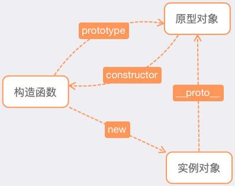
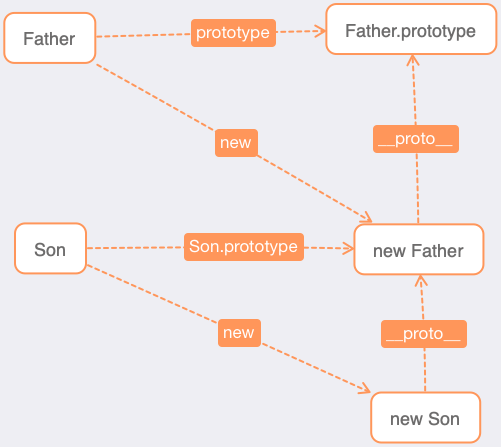
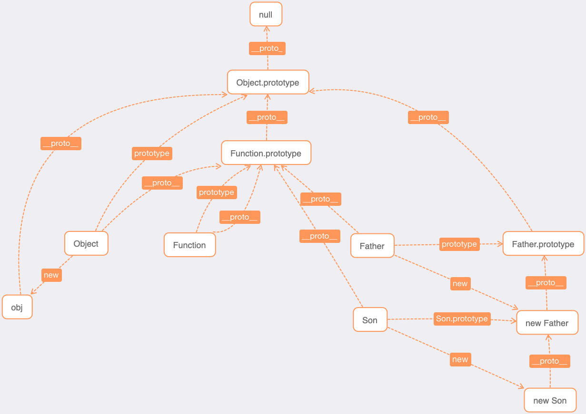

# 原型和原型链

## 构造函数

### 构造函数的实例成员和静态成员

**实例成员**： 实例成员就是在构造函数内部，通过this添加的成员。实例成员只能通过实例化的对象来访问。

**静态成员**： 在构造函数本身上添加的成员，只能通过构造函数来访问

```js
const Person = function (name, age) {
  // 实例成员 - 实例属性，可以通过对象.属性访问的属性叫实例属性
  this.name = name
  this.age = age
}

// 静态成员 - 静态属性，挂载在构造函数
Person.info = 'nice'

// 实例成员 - 实例方法，挂载在原型链，生成的对象可直接点方法的方式调用
Person.prototype.say = function () {
  console.log('实例方法');
}

// 静态成员 - 静态方法
Person.show = function () {
  console.log('静态方法');
}

const p1 = new Person('steven', 20)
console.log(p1.name) // 实例属性获取方式
p1.say() // 实例方法调用方式
console.log(Person.info + '--') // 静态属性调用方式
Person.show() // 静态方法调用方式
```

ES6 class 版本

```js
class Animal {
  // 类构造器 默认为空
  // 构造器的作用：每当new一个类，会优先执行构造器中代码
  constructor(name, age) {
    // 实例成员 - 实例属性
    this.name = name
    this.age = age
  }

  // 静态成员 - 静态属性
  static info = 'es6 静态方法'

  // 实例成员 - 挂载原型对象上的实例方法
  jump() {
    console.log('es6 实例方法');
  }

  // 静态成员 - 静态方法
  static show() {
    console.log('es6 静态方法');
  }
}

const a1 = new Animal('大黄', 4)
console.log(a1.name); // 实例属性调用
console.log(Animal.info); // 静态方法
a1.jump() // 实例方法调用
Animal.show() // 静态方法调用
```

### new 一个新对象的过程

- step1：首先创建一个空对象，这个对象将会作为执行 new 构造函数之后，返回的对象实例

- step2：将上面创建的空对象的原型（`__proto__`），指向构造函数的 prototype 属性

- step3：将这个空对象赋值给构造函数内部的 this，并执行构造函数逻辑

- step4：根据构造函数执行逻辑，返回第一步创建的对象或者构造函数的显式返回值

### new 模拟实现

```js
function newFunc() {
  let [constructor, ...args] = [...arguments]
  // 1 以构造器的 prototype 属性为原型，创建新对象
  let obj = Object.create(constructor.prototype)
  // 2 将 this (也就是上一句中的新对象)和调用参数传给构造器，并执行构造函数
  let res = constructor.apply(obj, args)
  // 3 如果构造器没有手动返回对象，则返回第一步创建的新对象，如果有，则返回手动 return 的对象
  return res instanceof Object ? res : obj
}
```

### 实例的方法共享与不共享

- 在构造函数上直接定义方法（不共享）

```js
function Star() {
  this.sing = function () {
      console.log('我爱唱歌')
  }
}
let stu1 = new Star()
let stu2 = new Star()
stu1.sing() //我爱唱歌
stu2.sing() //我爱唱歌
console.log(stu1.sing === stu2.sing) // false
```

很明显，stu1 和 stu2 指向的不是一个地方。 所以 在构造函数上通过 this 来添加方法的方式来生成实例，每次生成实例，都是新开辟一个内存空间存方法。这样会导致内存的极大浪费，从而影响性能。

- 通过原型添加方法（共享）

构造函数通过原型分配的函数，是所有对象共享的。

```js
function Star(name) {
  this.name = name
}
Star.prototype.sing = function () {
  console.log(`${this.name}爱唱歌`)
};
let stu1 = new Star('Anne')
let stu2 = new Star('Haney')
stu1.sing() // Anne爱唱歌
stu2.sing() // Haney爱唱歌
console.log(stu1.sing === stu2.sing) // true
```

## 原型

- 我们创建的每个函数都有一个 prototype（原型）属性。使用原型的好处是可以让所有对象实例**共享**它所包含的属性和方法。

- 在默认情况下，所有**原型对象都会自动获得一个 constructor（构造函数）属性**，这个属性包含一个指向 prototype 属性所在函数的指针。

- **当为对象实例添加一个属性时，这个属性就会屏蔽原型中保存的同名属性**；换句话说，添加这个属性只会阻止我们访问原型中的那个属性，但不会修改那个属性。即使将这个属性设置为 null ，也只会在实例中设置这个属性，而不会恢复其指向原型的连接。不过，使用 delete 操作符则可以完全删除实例属性，从而让我们能够重新访问原型中的属性。

### 更简洁的原型语法

```js
function Person(){}

Person.prototype = {
  name : "Stone",
  age : 28,
  job : "Software Engineer",
  sayName : function () {
      console.log(this.name)
  }
}

// 重设构造函数，只适用于 ECMAScript 5 兼容的浏览器
Object.defineProperty(Person.prototype, "constructor", {
  enumerable: false,
  value: Person
})
```

### 原型的动态性

由于在原型中查找值的过程是一次搜索，因此我们对原型对象所做的任何修改都能够立即从实例上反映出来，即使是先创建了实例后修改原型也照样如此。

```js
function Person(){}
let friend = new Person()
Person.prototype.sayHi = function(){
  console.log("hi")
};

friend.sayHi() // "hi"（没有问题！）
```

尽管可以随时为原型添加属性和方法，并且修改能够立即在所有对象实例中反映出来，但如果是重写整个原型对象，那么情况就不一样了。我们知道，调用构造函数时会为实例添加一个指向最初原型的 `[[Prototype]]` 指针，而把原型修改为另外一个对象就等于切断了构造函数与最初原型之间的联系。请记住：实例中的指针仅指向原型，而不指向构造函数。

```js
function Person(){}
let friend = new Person();
Person.prototype = {
  constructor: Person,
  name : "Stone",
  age : 28,
  job : "Software Engineer",
  sayName : function () {
      console.log(this.name)
  }
}

friend.sayName()  // Uncaught TypeError: friend.sayName is not a function
```

### 原生对象的原型

原型的重要性不仅体现在创建自定义类型方面，就连所有原生的引用类型，都是采用这种模式创建的。所有原生引用类型（Object、Array、String，等等）都在其构造函数的原型上定义了方法。例如，在 `Array.prototype` 中可以找到 `sort()` 方法，而在 `String.prototype` 中可以找到 `substring()` 方法。

## 原型链

JavaScript 中描述了原型链的概念，并将原型链作为实现继承的主要方法。其基本思想是利用原型让一个引用类型继承另一个引用类型的属性和方法。简单回顾一下构造函数、原型和实例的关系：每个构造函数都有一个原型对象，原型对象都包含一个指向构造函数的指针，而实例都包含一个指向原型对象的内部指针。



让我们来看看实现原型链的基本模式:

```js
function Father(){
  this.value = true
}
Father.prototype.getValue = function(){
  return this.value
}

function Son(){
  this.value2 = false
}

// 继承了 Father
Son.prototype = new Father();

Son.prototype.getValue2 = function (){
  return this.value2
}

let son = new Son()
console.log(son.getValue())  // true
```

实例 son 调用 `getValue()` 方法，实际是经过了 `son.__proto__.__proto__.getValue` 的过程的，其中 `son.__proto__` 等于 `Son.prototype`，而 `Son.prototype.__proto__` 又等于 `Father.prototype`，所以 `son.__proto__.__proto__.getValue` 其实就是 `Father.prototype.getValue`。



另外，所有函数的默认原型都是 Object 的实例，因此默认原型都会包含一个内部指针 `__proto__`，指向 `Object.prototype`。这也正是所有自定义类型都会继承 `toString()`、`valueOf()` 等默认方法的根本原因。



## 如何优雅地实现继承

如果想使 Child 继承 Parent，那么

原型链实现继承最关键的要点是：

```js
Child.prototype = new Parent()
```

这样的实现，不同的 Child 实例的 `__proto__` 会引用同一 Parent 的实例。

构造函数实现继承的要点是：

```js
function Child (args) {
   // ...
   Parent.call(this, args)
}
```

这样的实现问题也比较大，其实只是实现了实例属性继承，Parent 原型的方法在 Child 实例中并不可用。

组合继承的实现才基本可用，其要点是：

```js
function Child (args1, args2) {
   // ...
   this.args2 = args2
   Parent.call(this, args1)
}
Child.prototype = new Parent()
Child.prototype.constructor = Child
```

它的问题在于 Child 实例会存在 Parent 的实例属性。因为我们在 Child 构造函数中执行了 Parent 构造函数。同时，`Child.__proto__` 也会存在同样的 Parent 的实例属性，且所有 Child 实例的 `__proto__` 指向同一内存地址。

同时上述实现也都没有对静态属性的继承

一个比较完整的实现为：

```js
function inherit(Child, Parent) {
    // 继承原型上的属性
   Child.prototype = Object.create(Parent.prototype)

    // 修复 constructor
   Child.prototype.constructor = Child

   // 存储超类
   Child.super = Parent

   // 静态属性继承
   if (Object.setPrototypeOf) {
       // setPrototypeOf es6
       Object.setPrototypeOf(Child, Parent)
   } else if (Child.__proto__) {
       // __proto__ es6 引入，但是部分浏览器早已支持
       Child.__proto__ = Parent
   } else {
       // 兼容 IE10 等陈旧浏览器
       // 将 Parent 上的静态属性和方法拷贝一份到 Child 上，不会覆盖 Child 上的方法
       for (var k in Parent) {
           if (Parent.hasOwnProperty(k) && !(k in Child)) {
               Child[k] = Parent[k]
           }
       }
   }

}
```

上面静态属性继承存在一个问题：在陈旧浏览器中，属性和方法的继承我们是静态拷贝的，继承完后续父类的改动不会自动同步到子类。这是不同于正常面向对象思想的。但是这种组合式继承，已经相对完美、优雅。

## ES6 实现继承剖析

在 ES6 时代，我们可以使用 class extends 进行继承。但是我们都知道 ES6 的 class 其实也就是 ES5 原型的语法糖。我们通过研究 Babel 编译结果，来深入了解一下。

```js
class Person {
   constructor(){
       this.type = 'person'
   }
}

class Student extends Person {
   constructor(){
       super()
   }
}

var student1 = new Student()
student1.type // "person"

student1 instanceof Student // true
student1 instanceof Person // true
student1.hasOwnProperty('type') // true
```

经过 Babel 编译，代码如下：

```js
var Person = function Person() {
  _classCallCheck(this, Person);
  this.type = 'person';
};

// 实现定义 Student 构造函数，它是一个自执行函数，接受父类构造函数为参数
var Student = (function(_Person) {
  // 实现对父类原型链属性的继承
  _inherits(Student, _Person);

  // 将会返回这个函数作为完整的 Student 构造函数
  function Student() {
      // 使用检测
      _classCallCheck(this, Student);  
      // _get 的返回值可以先理解为父类构造函数       
      _get(Object.getPrototypeOf(Student.prototype), 'constructor', this).call(this);
  }

  return Student;
})(Person);

// _x 为 Student.prototype.__proto__
// _x2 为'constructor'
// _x3 为 this
var _get = function get(_x, _x2, _x3) {
  var _again = true;
  _function: while (_again) {
      var object = _x,
          property = _x2,
          receiver = _x3;
      _again = false;
      // Student.prototype.__proto__ 为 null 的处理
      if (object === null) object = Function.prototype;
      // 以下是为了完整复制父类原型链上的属性，包括属性特性的描述符
      var desc = Object.getOwnPropertyDescriptor(object, property);
      if (desc === undefined) {
          var parent = Object.getPrototypeOf(object);
          if (parent === null) {
              return undefined;
          } else {
              _x = parent;
              _x2 = property;
              _x3 = receiver;
              _again = true;
              desc = parent = undefined;
              continue _function;
          }
      } else if ('value' in desc) {
          return desc.value;
      } else {
          var getter = desc.get;
          if (getter === undefined) {
              return undefined;
          }
          return getter.call(receiver);
      }
  }
};

function _inherits(subClass, superClass) {
  // superClass 需要为函数类型，否则会报错
  if (typeof superClass !== 'function' && superClass !== null) {
      throw new TypeError('Super expression must either be null or a function, not ' + typeof superClass);
  }
  // Object.create 第二个参数是为了修复子类的 constructor
  subClass.prototype = Object.create(superClass && superClass.prototype, {
      constructor: {
          value: subClass,
          enumerable: false,
          writable: true,
          configurable: true
      }
  });
  // Object.setPrototypeOf 是否存在做了一个判断，否则使用 __proto__
  if (superClass) Object.setPrototypeOf ? Object.setPrototypeOf(subClass, superClass) : subClass.__proto__ = superClass;
}
```

## [相关 API](api.md)
