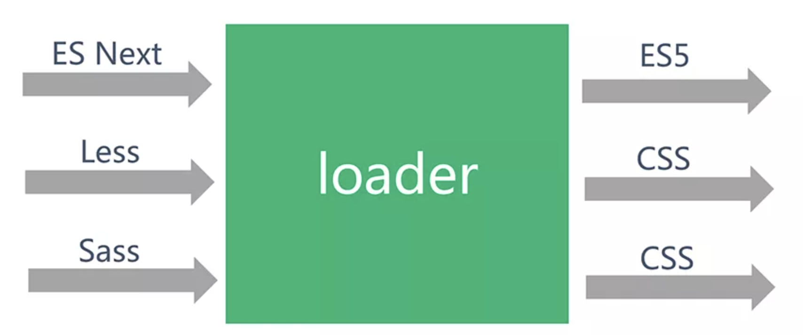

# webpack

## webpack 工作基本原理

webpack 工作流程可以简单总结为下图：


- 首先，webpack 会读取项目中由开发者定义的 webpack.config.js 配置文件，或者从 shell 语句中获得必要的参数。这是 webpack 内部接收业务配置信息的方式。这就完成了配置读取的初步工作。

- 接着，实例化所需 webpack 插件，在 webpack 事件流上挂载插件钩子，这样在合适的构建过程中，插件具备了改动产出结果的能力。

- 同时，根据配置所定义的入口文件，以入口文件（可以不止有一个）为起始，进行依赖收集：对所有依赖的文件进行编译，这个编译过程依赖 loaders，不同类型文件根据开发者定义的不同 loader 进行解析。编译好的内容使用 acorn 或其它抽象语法树能力，解析生成 AST 静态语法树，分析文件依赖关系，将不同模块化语法（如 require）等替换为 __webpack_require__，即使用 webpack 自己的加载器进行模块化实现。

- 上述过程进行完毕后，产出结果，根据开发者配置，将结果打包到相应目录。

值得一提的是，在这整个打包过程中，webpack 和插件采用基于事件流的发布订阅模式，监听某些关键过程，在这些环节中执行插件任务。到最后，所有文件的编译和转化都已经完成，输出最终资源。

如果深入源码，上述过程用更加专业的术语总结为——模块会经历加载（loaded）、封存（sealed）、优化（optimized）、分块（chunked）、哈希（hashed）和重新创建（restored）这几个经典步骤。在这里，我们了解大体流程即可。

## 抽象语法树 AST

在计算机科学中，抽象语法树（Abstract Syntax Tree，简称 AST），是源代码语法结构的一种抽象表示。它以树状的形式表现编程语言的语法结构，树上的每个节点都表示源代码中的一种结构和表达。

之所以说语法是「抽象」的，是因为这里的语法并不会表示出真实语法中出现的每个细节。比如类似于 if-condition-then 这样的条件跳转语句，可以使用带有两个分支的节点来表示。

AST 并不会被计算机所识别，更不会被运行，它是对编程语言的一种表达，为代码分析提供了基础。

webpack 将文件转换成 AST 的目的就是方便开发者提取模块文件中的关键信息。 这样一来，我们就可以「知晓开发者到底写了什么东西」，也就可以根据这些「写出的东西」，实现分析和扩展。在代码层面，我们可以把 AST 理解为一个 object：

```js
var ast = 'AST demo'
```

这样的语句转换为 AST 就是：

```js
{
 "type": "Program",
 "start": 0,
 "end": 20,
 "body": [
   {
     "type": "VariableDeclaration",
     "start": 0,
     "end": 20,
     "declarations": [
       {
         "type": "VariableDeclarator",
         "start": 4,
         "end": 20,
         "id": {
           "type": "Identifier",
           "start": 4,
           "end": 7,
           "name": "ast"
         },
         "init": {
           "type": "Literal",
           "start": 10,
           "end": 20,
           "value": "AST demo",
           "raw": "'AST demo'"
         }
       }
     ],
     "kind": "var"
   }
 ],
 "sourceType": "module"
}
```

从中我们可以看出，AST 结果精确地表明了这是一条变量声明语句，语句起始于哪里，赋值结果是什么等信息都被表达出来。

## compiler 和 compilation

compiler 和 compilation 这两个对象是 webpack 核心原理中最重要的概念。它们是理解 webpack 工作原理、loader 和插件工作的基础。

- compiler 对象：它的实例包含了完整的 webpack 配置，全局只有一个 compiler 实例，因此它就像 webpack 的骨架或神经中枢。当插件被实例化的时候，会收到一个 compiler 对象，通过这个对象可以访问 webpack 的内部环境。

- compilation 对象：当 webpack 以开发模式运行时，每当检测到文件变化，一个新的 compilation 对象将被创建。这个对象包含了当前的模块资源、编译生成资源、变化的文件等信息。也就是说，所有构建过程中产生的构建数据都存储在该对象上，它也掌控着构建过程中的每一个环节。该对象也提供了很多事件回调供插件做扩展。

两者的关系可以通过以下图示说明：


webpack 的构建过程是通过 compiler 控制流程，compilation 进行解析。在开发插件时，我们可以从 compiler 对象中拿到所有和 webpack 主环境相关的内容，包括事件钩子。

compiler 对象和 compilation 对象都继承自 tapable，tapable.js 这个库暴露了所有和事件相关的 pub/sub 的方法。webpack 基于事件流的 tapable 库，不仅能保证插件的有序性，还使得整个系统扩展性更好。

## 探秘并编写 webpack loader

熟悉了概念，我们就来进行实战：了解如何编写一个 webpack loader。事实上，在 webpack 中，loader 是魔法真正发生的阶段之一：Babel 将 ES Next 编译成 ES5，sass-loader 将 SCSS/Sass 编译成 CSS 等，都是由相关 loader 或者 plugin 完成的。因此，直观上理解，loader 就是接受源文件，对源文件进行处理，返回编译后文件。如图：



我们看到一个 loader 秉承单一职责，完成最小单元的文件转换。当然，一个源文件可能需要经历多步转换才能正常使用，比如 Sass 文件先通过 sass-loader 输出 CSS，之后将内容交给 css-loader 处理，甚至 css-loader 输出的内容还需要交给 style-loader 处理，转换成通过脚本加载的 JavaScript 代码。如下使用方式：

```js
module.exports = {
 // ...
 module: {
   rules: [{
     test: /\.less$/,
     use: [{
       loader: 'style-loader' // 通过 JS 字符串，创建 style node
     }, {
       loader: 'css-loader' // 编译 css 使其符合 CommonJS 规范
     }, {
       loader: 'less-loader' // 编译 less 为 css
     }]
   }]
 }
}
```

当我们调用多个 loader 串联去转换一个文件时，每个 loader 会链式地顺序执行。webpack 中，在同一文件存在多个匹配 loader 的情况下，遵循以下原则：

- loader 的执行顺序是和配置顺序相反的，即配置的最后一个 loader 最先执行，第一个 loader 最后执行。

- 第一个执行的 loader 接收源文件内容作为参数，其他 loader 接收前一个执行的 loader 的返回值作为参数。最后执行的 loader 会返回最终结果。

如图，对应上面代码：


因此，在你开发一个 loader 时，请保持其职责的单一性，只需关心输入和输出。

不难理解：loader 本质就是函数，其最简单的结构为：

```js
module.exports = function(source){
  // some magic...
  return content
}
```

loader 就是一个基于 CommonJS 规范的函数模块，它接受内容（这个内容可能是源文件也可能是经过其他 loader 处理后的结果），并返回新的内容。

更进一步，我们知道在配置 webpack 时，对于 loader 可以增加一些配置，比如著名的 babel-loader 的简单配置：

```js
module:{
  rules:[
    {
      test: /\.js$/,
      exclude: /node_modules/,
      loader: "babel-loader",
      options: {
        "plugins": [
          "dynamic-import-webpack"
        ]
      }
    }
  ]
}
```

这样一来，上文简单的 loader 写法便不能满足需求了，因为我们除了 source 以外，还需要根据开发者配置的 options 信息进行处理，以输出最后结果。那么如何获取 options 呢？这时候就需要 loader-utils 模块了：

```js
const loaderUtils = require("loader-utils")
module.exports = function(source) {
  // 获取开发者配置的 options
  const options = loaderUtils.getOptions(this)
  // some magic...
  return content
}
```

另外，对于 loader 返回的内容，在实际开发中，单纯对 content 进行改写并返回也许是不够的。

比如，我们想对 loader 处理过程中的错误进行捕获，或者又想导出 sourceMap 等信息，该如何做呢？

这种情况需要用到 loader 中的 this.callback 进行内容的返回。this.callback 可以传入四个参数，分别是：

- error：Error | null，当 loader 出错时向外抛出一个 error

- content：String | Buffer，经过 loader 编译后需要导出的内容

- sourceMap：为方便调试生成的编译后内容的 source map

- ast：本次编译生成的 AST 静态语法树，之后执行的 loader 可以直接使用这个 AST，进而省去重复生成 AST 的过程

这样，我们的 loader 代码变得更加复杂，同时也能够处理更多样的需求：

```js
module.exports = function(source) {
  // 获取开发者配置的 options
  const options = loaderUtils.getOptions(this)
  // some magic...
  // return content
  this.callback(null, content)
}
```

注意　当我们使用 this.callback 返回内容时，该 loader 必须返回 undefined，这样 webpack 就知道该 loader 返回的结果在 this.callback 中，而不是 return 中。

细心的读者会问，这里的 this 指向谁？事实上，这个 this 是一个叫 loaderContext 的 loader-runner 特有对象。如果刨根问底，就要细读 webpack loader 部分相关源码了。

默认情况下，webpack 传给 loader 的内容源都是 UTF-8 格式编码的字符串。但请思考 file-loader 这个常用的 loader，它不是处理文本文件，而是处理二进制文件的，这种情况下，我们可以通过：`source instanceof Buffer === true` 来判断内容源类型：

```js
module.exports = function(source) {
   source instanceof Buffer === true
   return source
}
```

如果自定义的 loader 也会返回二进制文件，需要在文件中显式注明：

```js
module.exports.raw = true
```

当然，还存在异步 loader 的情况，即对 source 的处理并不能同步完成，这时候使用简单的 async-await 即可：

```js
module.exports = async function(source) {
  function timeout(delay) {
    return new Promise((resolve, reject) => {
      setTimeout(() => {
        resolve(source)
      }, delay)
    })
  }
  const content = await timeout(1000)
  this.callback(null, content)
}
```

另一种异步 loader 解决方案是使用 webpack 提供的 this.async，调用 this.async 会返回一个 callback Function，在异步完成之后，我们进行调用。上面的示例代码可以改写为：

```js
module.exports = async function(source) {
  function timeout(delay) {
    return new Promise((resolve, reject) => {
      setTimeout(() => {
          resolve(source)
      }, delay)
    })
  }
  const callback = this.async()
  timeout(1000).then(data => {
    callback(null, data)
  })
}
```

实际上，对于我们熟悉的 less-loader，翻看其源码，就能发现它的核心是利用 less 这个库来解析 less 代码，less 会返回一个 promise，因此 less-loader 是异步的，其实现正是运用了 `this.async()` 来完成。

## 探秘并编写 webpack plugin

除了 webpack loader 这个核心概念以外，webpack plugin 是另一个重要话题。loader 和 plugin 就像 webpack 的双子星，有着共同之处，但是分工却很明晰。

我们反复提到过 webpack 事件流机制，也就是说在 webpack 构建的生命周期中，会广播许多事件。这时候，开发中注册的各种插件，便可以根据需要监听与自身相关的事件。捕获事件后，在合适的时机通过 webpack 提供的 API 去改变编译输出结果。

因此，我们可以总结出 loader 和 plugin 的差异。

- loader 其实就是一个转换器，执行单纯的文件转换操作。

- plugin 是一个扩展器，它丰富了 webpack 本身，在 loader 过程结束后，webpack 打包的整个过程中，weback plugin 并不直接操作文件，而是基于事件机制工作，监听 webpack 打包过程中的某些事件，见缝插针，修改打包结果。

### 如何从零开始编写一个 webpack 插件

首先我们要清楚当前插件要解决什么问题，根据问题，找到相应的钩子事件，在相关事件中进行操作，改变输出结果。这就需要清楚开发中都有哪些钩子了，下面列举一些常用的，完整内容可以在官网找到：[Compiler 暴露的所有事件钩子](https://webpack.js.org/api/compiler-hooks/)

我们知道 compiler 对象暴露了和 webpack 整个生命周期相关的钩子，通过如下的方式访问：

```js
//基本写法
compiler.hooks.someHook.tap(...)
```

例如，如果希望 webpack 在读取 entry 配置完后就执行某项工作，我们可以：

```js
compiler.hooks.entryOption.tap(...)
```

因为名字为 entryOption 的 SyncBailHook 类型 hook，就表明了入口配置信息执行完毕的事件，在相关 tap 函数中我们可以在这个时间节点插入操作。

又如，如果希望在生成的资源输出之前执行某个功能，我们可以：

```js
compiler.hooks.emit.tap(...)
```

因为名字为 emit 的 AsyncSeriesHook 类型 hook，就表明了资源输出前的时间节点。

一个自定义 webpack plugin 的骨架结构就是一个带有 apply 方法的 class（用 prototype 实现同理 `CustomPlugin.prototype.apply = function () {...}`）：

```js
class CustomPlugin {
  constructor(options) {
    this.options = options
  }
  apply(compiler) {
    // 相关钩子注册回调
    compiler.hooks.someHook.tap('CustomPlugin', () => {
      // magic here...
    })

    // 打印出此时 compiler 暴露的钩子
    for(var hook of Object.keys(compiler.hooks)){
      console.log(hook)
    }
  }
}

module.exports = customPlugin
```

除了 compiler 暴露了与 webpack 整体构建生命周期相关的钩子以外，compilation 也暴露了与模块和依赖有关的粒度更小的钩子，读者可以参考：[compilation 暴露的所有事件钩子](https://webpack.js.org/api/compilation-hooks/)，找到合适的时机插入自定义行为。

其实 compilation 是 compiler 生命周期中的一个步骤，使用 compilation 相关钩子的通用写法为：

```js
class CustomPlugin {
  constructor(options) {
    this.options = options
  }
  apply(compiler) {
    compiler.hooks.compilation.tap('CustomPlugin', function(compilation, callback) {
      compilation.hooks.someOtherHook.tap('SomePlugin',function() {
        // some magic here
      })
    })
  }
}

module.exports = customPlugin
```

最终，我们可以总结一下 webpack 插件的套路。

- 定义一个 JavaScript class 函数，或在函数原型（prototype）中定义一个以 compiler 对象为参数的 apply 方法。

- apply 函数中通过 compiler 插入指定的事件钩子，在钩子回调中拿到 compilation 对象。

- 使用 compilation 操纵修改 webpack 打包内容。

当然，plugin 也存在异步的情况，一些事件钩子是异步的。相应地，我们可以使用 tapAsync 和 tapPromise 方法来处理：

```js
class CustomAsyncPlugin {
  constructor(options) {
    this.options = options
  }
  apply(compiler) {
    compiler.hooks.emit.tapAsync('CustomAsyncPlugin', function(compilation, callback) {
      setTimeout(() => {
        callback()
      }, 1000)
    })

    compiler.hooks.emit.tapPromise('CustomAsyncPlugin', function(compilation, callback) {
      return asyncFun().then(() => {
        //...
      })
    })
  }
}
```
